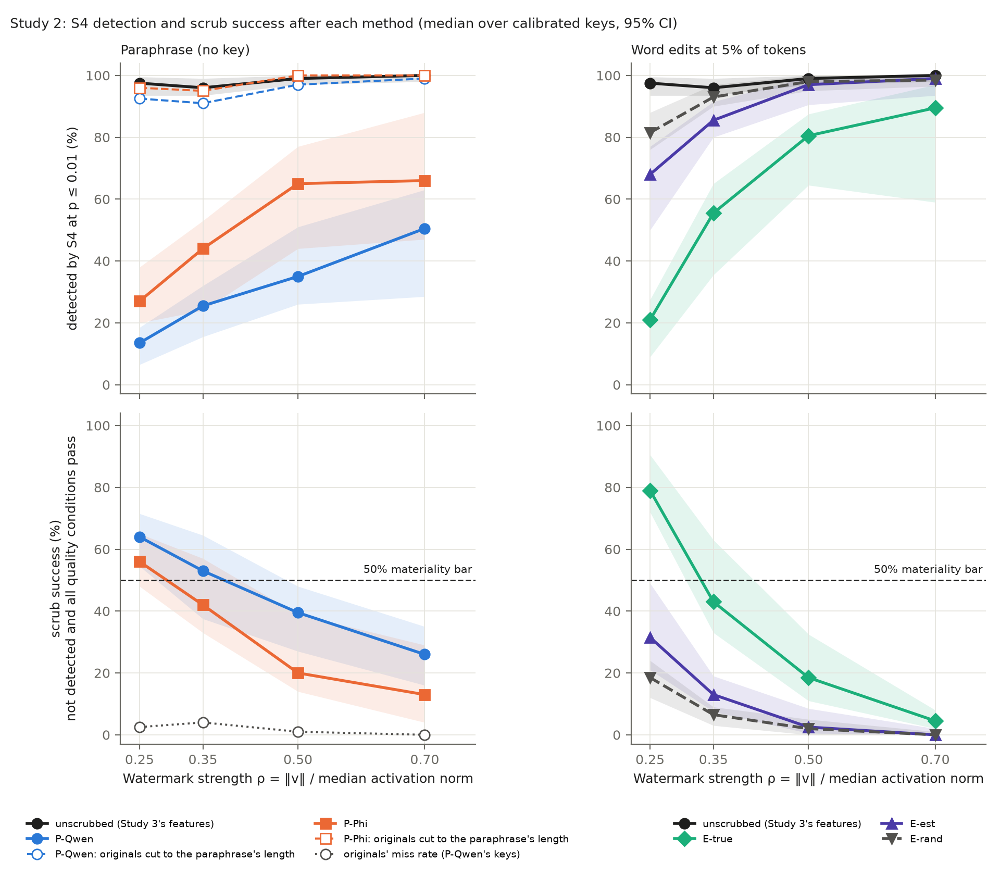
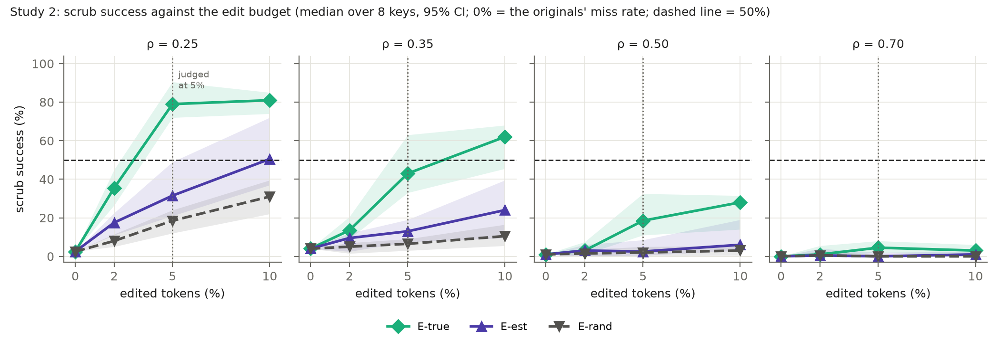
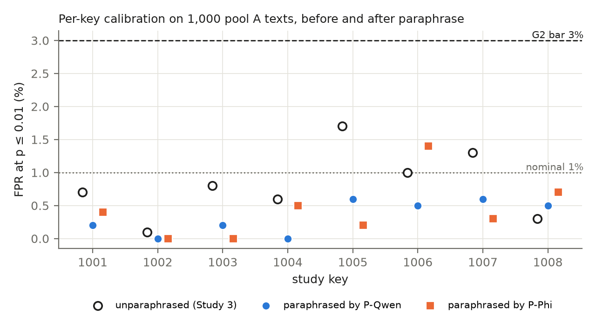
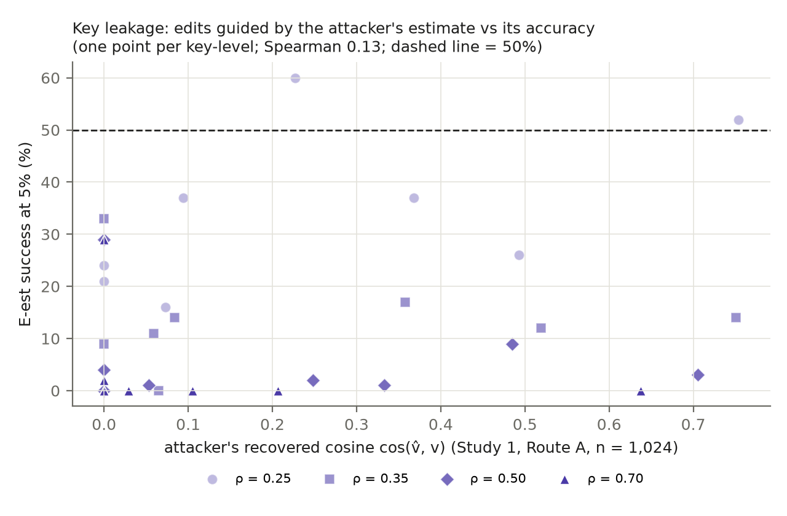
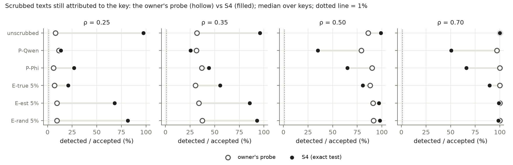

# Study 2 — report v0.1: scrubbing an activation-steering watermark under the exact key test (Qwen2.5-1.5B)

Date: 2026-10-02 (Milestone 7). Protocol: [`STUDY2_PROTOCOL_v0.1.md`](STUDY2_PROTOCOL_v0.1.md) (LOCKED 2026-10-01 16:12 UTC (11:12 CDT), before outcomes). Lock: [`outputs/study2_v0.1/PRE_RUN_LOCK.json`](outputs/study2_v0.1/PRE_RUN_LOCK.json). Run manifest: [`outputs/study2_v0.1/RUN_MANIFEST.json`](outputs/study2_v0.1/RUN_MANIFEST.json). Results: [`outputs/study2_v0.1/results.json`](outputs/study2_v0.1/results.json). **This file is built by** `study2_report/make_report_s2.py`, **which inserts the tables, the samples and every number in the text from the locked outputs; no number is typed by hand.** The builder was written during phase 1, before any Study 2 outcome was read, and tested on a synthetic fixture. Figures: `outputs/study2_v0.1/report/`.

## 1. Run
- **Phase 1 (paraphrase):** 2026-10-01 16:23 UTC (11:23 CDT) to 2026-10-02 08:43 UTC (03:43 CDT), 16.3 h, on a freshly restarted Mac with other apps closed (swap 0 at the start).
- **Phase 2 (edits, then scoring), 2026-10-02:** edits 08:43–14:26 UTC (03:43–09:26 CDT), 5.7 h; scoring 14:26–18:57 UTC (09:26–13:57 CDT), 4.5 h; analysis 18:58–18:59 UTC (13:58–13:59 CDT), 0.0 h. Total 26.6 h against the 24.3 h projection.
- `check_lock()` accepted the lock before each phase and again after the run (protocol, 13 code files, 164 reused files unchanged). The holdout was not touched (`final: false`). Deviations: none.
- The report builder re-computed, with its own implementation of the S4 test and of the quality conditions, every key's FPR on the paraphrased null texts (G1, G2), the detection before scrubbing (P1), each key's detection and success after every method at every level, the originals' miss rate, the first-attempt readings, the length-matched control and the probe's acceptance. It re-derived every S1, S2 and C1 verdict from the §7 rules and asserted that all of these equal `results.json` (all equal).

## 2. Pre-registered results (protocol §7)
### Table 1 — Pre-registered rules vs observed (protocol §7)

**P-Qwen (Qwen2.5-1.5B-Instruct).** G1 (pooled FPR over 8 keys × 1,000 paraphrased pool A texts, pass if 0.3–2.5%): 0.33% → **PASS**. G2 (a key is calibrated if its FPR ≤ 3.0%): 8 of 8 calibrated → verdicts **made**.

**P-Phi (Phi-3.5-mini-instruct).** G1 (pooled FPR over 8 keys × 1,000 paraphrased pool A texts, pass if 0.3–2.5%): 0.44% → **PASS**. G2 (a key is calibrated if its FPR ≤ 3.0%): 8 of 8 calibrated → verdicts **made**.

| ρ | P1: detected before, median (≥ 20%) | S1 P-Qwen: success [95% CI] vs originals' miss [95% CI]; keys ≥ 50% | S1 P-Phi: same | S2 E-true 5%: success [95% CI]; keys ≥ 50% | S2 E-est 5%: same | E-rand 5%: success [95% CI] | C1: E-est − E-rand, median [95% CI] |
|---|---|---|---|---|---|---|---|
| 0.25 | 97.5% (pass) | **effective**: 64.0 [54.5, 71.5] vs 2.5 [0.5, 6.5]; 7 of 8 | **effective**: 56.0 [48.0, 65.0] vs 3.0 [0.0, 6.0]; 7 of 8 | **effective**: 79.0 [72.0, 90.5]; 8 of 8 | **not effective**: 31.5 [21.0, 49.0]; 2 of 8 | 18.5 [12.0, 24.0] | **the estimate helps**: +14.5 [5.0, 28.0] |
| 0.35 | 96.0% (pass) | **effective**: 53.0 [37.5, 64.5] vs 4.0 [1.0, 6.5]; 5 of 8 | **inconclusive**: 42.0 [33.0, 57.0] vs 3.0 [0.0, 7.0]; 2 of 8 | **inconclusive**: 43.0 [33.0, 63.0]; 3 of 8 | **not effective**: 13.0 [7.5, 19.0]; 0 of 8 | 6.5 [3.0, 9.0] | **the estimate helps**: +6.5 [2.0, 11.0] |
| 0.50 | 99.0% (pass) | **not effective**: 39.5 [27.0, 48.0] vs 1.0 [0.0, 3.0]; 1 of 8 | **not effective**: 20.0 [14.0, 39.0] vs 0.0 [0.0, 2.0]; 1 of 8 | **not effective**: 18.5 [11.0, 32.5]; 1 of 8 | **not effective**: 2.5 [0.5, 8.5]; 0 of 8 | 2.0 [0.0, 5.0] | **no clear difference**: +0.0 [-0.5, 7.0] |
| 0.70 | 100.0% (pass) | **not effective**: 26.0 [16.0, 35.0] vs 0.0 [0.0, 2.0]; 1 of 8 | **not effective**: 13.0 [4.0, 29.0] vs 0.0 [0.0, 2.0]; 1 of 8 | **not effective**: 4.5 [2.0, 8.0]; 0 of 8 | **not effective**: 0.0 [0.0, 2.0]; 0 of 8 | 0.0 [0.0, 1.0] | **no clear difference**: +0.0 [-0.5, 0.0] |

Success = not detected by S4 at p ≤ 0.01 **and** all four quality conditions pass (fluency, repetition, length, meaning; protocol §5, normal range at the human 95th percentile). Medians over the calibrated keys (paraphrase: G2 per paraphraser; edits: all 8 keys, Study 3's calibration), with 95% cluster-bootstrap intervals (keys, then texts). P-Phi scrubs the first 50 genuine texts per key-level, the others all 100. "Random edits suffice" marks a level where E-rand's own median success at 5% reaches 50% (protocol §7, bounds).

**In words (evidence; every number is filled from `results.json`):**
- **Gates.** G1 passes for both paraphrasers (pooled FPR on the paraphrased null texts 0.33% for P-Qwen and 0.44% for P-Phi, against 0.3–2.5%). G2: all 8 keys are calibrated for P-Qwen (per-key FPR 0.0–0.6%) and all 8 for P-Phi (0.0–1.4%), so every verdict is made. P1 passes at every level: S4 detected 97.5%, 96.0%, 99.0% and 100.0% of the genuine texts before scrubbing.
- **S1, paraphrase removes the evidence?** At ρ = 0.25, **both paraphrasers are effective**: P-Qwen succeeds on 64.0% of the typical key's texts [54.5, 71.5] and P-Phi on 56.0% [48.0, 65.0], against the originals' own miss rates of 2.5% and 3.0%; 7 and 7 of 8 keys are at or above 50%. At ρ = 0.35, **P-Qwen is effective** (53.0% [37.5, 64.5]; 5 of 8 keys) and **P-Phi inconclusive** (42.0% [33.0, 57.0]; 2 of 8). At ρ = 0.50 and 0.70 **neither is effective**: P-Qwen 39.5% [27.0, 48.0] and 26.0% [16.0, 35.0]; P-Phi 20.0% [14.0, 39.0] and 13.0% [4.0, 29.0]; one key in each cell reaches 50%.
- **S2, key-guided edits of 5% of the words.** **E-true (the true key) is effective only at ρ = 0.25**: 79.0% [72.0, 90.5], all 8 keys at or above 50%, against E-rand's 18.5% [12.0, 24.0]. It is **inconclusive at 0.35** (43.0% [33.0, 63.0]; 3 of 8 keys) and **not effective at 0.50 and 0.70** (18.5% [11.0, 32.5]; 4.5% [2.0, 8.0]). **E-est (the attacker's Study 1 estimate) is not effective at every level**: 31.5% [21.0, 49.0], 13.0% [7.5, 19.0], 2.5% [0.5, 8.5] and 0.0% [0.0, 2.0]; 2 of 8 keys reach 50% at ρ = 0.25 (keys 1002 at 60% and 1004 at 52%), none above.
- **C1, does the estimate help?** Yes at ρ = 0.25 and 0.35: E-est beats E-rand by +14.5 points [5.0, 28.0] and +6.5 points [2.0, 11.0] (median over keys, paired). No clear difference at 0.50 (+0.0 [-0.5, 7.0]) or 0.70 (+0.0 [-0.5, 0.0]).
- **Bounds (protocol §7).** E-rand never reaches 50% (its highest median is 18.5% at ρ = 0.25), so no level is "random edits suffice". The paraphrase comparison (the originals' miss rate, 0.0–4.0%) stays far below the 50% bar.
- **Narrowest margins, stated plainly.** P-Qwen at ρ = 0.35 is "effective" with a median of 53.0% and 5 of 8 keys above 50%; its interval [37.5, 64.5] reaches below 50% (the rule needs the median at or above 50% and separation from the originals' miss rate, both met). P-Phi at ρ = 0.25 has a lower bound of 48.0% ([48.0, 65.0]). E-est at ρ = 0.25 is "not effective" because its upper bound [21.0, 49.0] falls just under 50%. E-true at ρ = 0.35 straddles the bar ([33.0, 63.0]).
- **Materiality.** At ρ ≤ 0.35 the typical key no longer gives provenance evidence for most of its texts after an off-the-shelf paraphrase at matched quality. At ρ ≥ 0.50 these attackers, with or without the true key, leave S4's evidence in most of the typical key's texts at 5% edits or after paraphrase.

**What drives the numbers (descriptive; protocol §8):**
- **Evidence is removed, not shortened.** After P-Qwen, S4 detects 13.5% of the texts at ρ = 0.25 and 50.5% at 0.70 (P-Phi: 27.0% and 66.0%). The length-matched control, each original cut to its paraphrase's token count, is still detected 91.0–99.0% of the time across levels (P-Phi's lengths: 95.0–100.0%).
- **Quality is the other half of success.** Among P-Qwen paraphrases that evade S4, 74% pass all four quality conditions at ρ = 0.25 and 53% at 0.70 (P-Phi: 77% and 38%). P-Qwen's all-four pass rate falls from 75.0% to 49.5%, through the meaning condition (71.0% pass at 0.70) and the fluency condition (77.5%). After three attempts, 32.0% of the kept P-Qwen paraphrases and 28.6% of P-Phi's still fail the attacker's own check. Retries matter: first attempts alone succeed 49.5% (P-Qwen, ρ = 0.25) against 64.0% with retries.
- **A key-holder can remove the evidence at ρ ≥ 0.50 only at a visible fluency cost.** E-true at 10% of the words brings detection down to 0.5%, 7.0%, 19.5% and 40.0% at the four levels, but the fluency condition then passes only 83.5%, 66.0%, 31.5% and 3.5% (median perplexity ratio 2.74× at 0.50 and 2.30× at 0.70), so success at 10% is 28.0% and 3.0%. E-rand at 10% has nearly the same fluency cost (42.5% and 4.0% pass) with almost no effect on detection (96.0% and 97.5%).
- **The attacker's estimate points the wrong way.** E-est lowers its own objective (the estimated direction's summed contribution, median) from 0.43 to -0.31 at 5% and -0.68 at 10%, yet S4's detection barely moves (68.0% against E-rand's 81.5% at ρ = 0.25; 97.0% against 98.0% at 0.50). E-true's objective falls from 3.15 to 1.41 over the same budget. The Spearman correlation between the attacker's recovered cosine and E-est's success over the 32 key-levels is 0.13.
- **One weak key.** Key 1002 was detected before scrubbing only 41% of the time at ρ = 0.70 (every other key at least 98%; its FPR in Study 3 was 0.1%). It is scrubbed by random 5% edits 35% of the time (every other key at most 1%), by E-true 43%, by P-Qwen 53% and by P-Phi 60%. The medians hide this; Table 4 shows it.
- **Pooling and a stricter threshold restore some evidence.** Four P-Qwen paraphrases pooled per test are detected 26.0%, 56.0%, 82.0% and 90.0% of the time at the four levels (P-Phi: 62.5%, 91.7%, 100.0%, 100.0%). At p ≤ 0.001, single P-Qwen paraphrases are detected 3.0–19.0%.
- **Calibration after paraphrase.** The eight study keys' FPR fell (pooled 0.33% and 0.44% against 0.81% before paraphrase). Over 1,000 fresh public-distribution keys the mean FPR is 1.02% and 0.94% (the test stays exact on average), but 7.8% and 6.5% of them exceed 3% (maxima 22.6% and 19.5%): the per-key rate disperses after paraphrase, so an owner should check their own key on paraphrased null text.
- **The owner's trained probe (secondary).** At ρ = 0.70 the probe still accepts 97.0% of P-Qwen's and 100.0% of P-Phi's paraphrases, and at 0.50 79.0% and 90.0%, where S4 detects 50.5% / 66.0% and 35.0% / 65.0%; its FPR on the paraphrased pool A2 texts is 3.3% and 3.0% (nominal 1%). Caveat: a trained classifier may accept a paraphrase because it keeps the steering's content footprint rather than the key; this is a lead for the claim gate, not a result.
- **Stricter quality readings.** Under the model-text bar (perplexity 95th percentile of pool A's model texts), paraphrase success at ρ = 0.25 is 3.5% (P-Qwen) and 3.0% (P-Phi); under the human-median bar, 23.0% and 17.0%. The pilot found that the model-text bar rejects most human text, so these are floors, not alternative verdicts.
- **Samples (§4; the numbers there are generated).** For the first pool D text of keys 1001 and 1002 at ρ = 0.50 no scrub succeeded. Both paraphrases of each read fluently and keep most of the meaning; they fail on narrow margins (P-Qwen's perplexity just above the bar for key 1001; a cosine just below it for key 1002 after two sentences were dropped) or stay detected. The 5% edits read with a few slips ("we's important", "the league and me and better player"); the 10% edits are visibly degraded ("For's take a quick example", "you'm gonna love") and fail the fluency bar, which matches the pilot's reason for judging at 5%. The only undetected edit among the samples (E-true at 10%, key 1002) fails fluency.
- **Timing.** 26.6 h against the 24.3 h projection; phase 1 took 16.3 h (projected 13.9), because the attacker's self-check retried more texts than in the pilot.

**Interpretation (inference, for the claim gate; not a pre-registered result):**
- The exact key test's evidence survives off-the-shelf paraphrase and key-guided 5% edits at ρ ≥ 0.50, and does not at ρ ≤ 0.35. The true key helps only where the watermark is weak (ρ = 0.25), so key secrecy protects least where it would matter most; Study 1's recovered key is too inaccurate to make edits practical anywhere.
- Taken with the calibrations (no ρ on these models was both quality-neutral and detectable by the probe) and Study 3 (the exact test detects ρ = 0.25 at 97.5%), this points to a three-way trade-off for the paper: the strengths the exact test rescues for detection are the strengths that paraphrase scrubs, and the strengths that resist scrubbing are the ones with a quality cost.

## 3. Figures and tables

### Table 2 — Calibration after paraphrase: each key's FPR at p ≤ 0.01 (%) on 1,000 pool A texts

| null texts | 1001 | 1002 | 1003 | 1004 | 1005 | 1006 | 1007 | 1008 | pooled | keys > 3% | fresh keys: mean FPR | fresh keys > 3% | probe FPR on pool A2 (median) |
|---|---|---|---|---|---|---|---|---|---|---|---|---|---|
| unparaphrased (Study 3) | 0.7 | 0.1 | 0.8 | 0.6 | 1.7 | 1.0 | 1.3 | 0.3 | 0.81 | 0 | — | — | — |
| paraphrased by P-Qwen | 0.2 | 0.0 | 0.2 | 0.0 | 0.6 | 0.5 | 0.6 | 0.5 | 0.33 | 0 | 1.02 | 7.8% (max 22.6) | 3.3 |
| paraphrased by P-Phi | 0.4 | 0.0 | 0.0 | 0.5 | 0.2 | 1.4 | 0.3 | 0.7 | 0.44 | 0 | 0.94 | 6.5% (max 19.5) | 3.0 |

Fresh keys: 1,000 public-distribution keys never used by the owner (seeds 44,400,000 + j), each tested on the same paraphrased texts; the share above 3% estimates how often a newly drawn key would fail G2 after paraphrase. The probe row is the owner's trained probe (Study 1) at its own 1% threshold on the paraphrased pool A2 texts (secondary).

### Table 3 — Detection, quality and success per method (median over keys, %; ρ by row)

| ρ | method | detected after | success [95% CI] | keys ≥ 50% | passes fluency | repetition | length | meaning | all four | median ppl ratio | median length ratio | median cosine | success, model-text bar | success, human-median bar |
|---|---|---|---|---|---|---|---|---|---|---|---|---|---|---|
| 0.25 | P-Qwen | 13.5 | 64.0 [54.5, 71.5] | 7 | 99.0 | 99.5 | 89.0 | 80.5 | 75.0 | 1.97 | 0.99 | 0.886 | 3.5 | 23.0 |
| 0.25 | P-Phi | 27.0 | 56.0 [48.0, 65.0] | 7 | 100.0 | 100.0 | 98.0 | 84.0 | 83.0 | 2.03 | 1.05 | 0.902 | 3.0 | 17.0 |
| 0.25 | E-true 2% | 64.0 | 35.5 [26.5, 45.0] | 0 | 100.0 | 100.0 | 100.0 | 100.0 | 100.0 | 1.38 | 1.00 | 0.993 | 12.0 | 32.5 |
| 0.25 | E-est 2% | 82.0 | 17.5 [11.0, 22.5] | 0 | 100.0 | 100.0 | 100.0 | 100.0 | 100.0 | 1.39 | 1.00 | 0.992 | 6.0 | 16.5 |
| 0.25 | E-rand 2% | 92.0 | 8.0 [5.0, 11.5] | 0 | 100.0 | 100.0 | 100.0 | 100.0 | 100.0 | 1.33 | 1.00 | 0.995 | 4.0 | 8.0 |
| 0.25 | E-true 5% | 21.0 | 79.0 [72.0, 90.5] | 8 | 100.0 | 100.0 | 100.0 | 99.5 | 99.0 | 1.90 | 1.00 | 0.982 | 3.0 | 47.5 |
| 0.25 | E-est 5% | 68.0 | 31.5 [21.0, 49.0] | 2 | 100.0 | 100.0 | 100.0 | 99.5 | 99.0 | 1.92 | 1.00 | 0.977 | 1.5 | 20.5 |
| 0.25 | E-rand 5% | 81.5 | 18.5 [12.0, 24.0] | 0 | 100.0 | 100.0 | 100.0 | 100.0 | 99.5 | 1.78 | 1.00 | 0.987 | 2.0 | 13.0 |
| 0.25 | E-true 10% | 0.5 | 81.0 [74.0, 85.0] | 8 | 83.5 | 99.5 | 100.0 | 99.0 | 81.5 | 3.22 | 1.00 | 0.957 | 0.0 | 3.0 |
| 0.25 | E-est 10% | 39.5 | 50.5 [37.0, 72.0] | 4 | 84.0 | 100.0 | 100.0 | 97.0 | 81.5 | 3.22 | 1.00 | 0.949 | 0.0 | 2.5 |
| 0.25 | E-rand 10% | 62.5 | 31.0 [22.0, 39.5] | 0 | 92.0 | 100.0 | 100.0 | 98.5 | 89.5 | 2.90 | 1.00 | 0.968 | 0.0 | 5.0 |
| 0.35 | P-Qwen | 25.5 | 53.0 [37.5, 64.5] | 5 | 97.0 | 99.0 | 89.0 | 79.5 | 74.0 | 1.87 | 0.99 | 0.886 | 4.5 | 16.0 |
| 0.35 | P-Phi | 44.0 | 42.0 [33.0, 57.0] | 2 | 100.0 | 99.0 | 97.0 | 82.0 | 79.0 | 1.92 | 1.04 | 0.893 | 2.0 | 12.0 |
| 0.35 | E-true 2% | 86.0 | 13.5 [9.0, 20.5] | 0 | 100.0 | 99.5 | 100.0 | 100.0 | 99.5 | 1.35 | 1.00 | 0.992 | 5.0 | 12.0 |
| 0.35 | E-est 2% | 90.5 | 9.5 [2.5, 12.0] | 0 | 100.0 | 100.0 | 100.0 | 100.0 | 99.5 | 1.37 | 1.00 | 0.991 | 2.5 | 8.5 |
| 0.35 | E-rand 2% | 95.0 | 5.0 [1.5, 7.0] | 0 | 100.0 | 100.0 | 100.0 | 100.0 | 100.0 | 1.31 | 1.00 | 0.995 | 1.0 | 3.5 |
| 0.35 | E-true 5% | 55.5 | 43.0 [33.0, 63.0] | 3 | 99.0 | 99.5 | 100.0 | 99.0 | 98.0 | 1.84 | 1.00 | 0.978 | 1.0 | 21.0 |
| 0.35 | E-est 5% | 85.5 | 13.0 [7.5, 19.0] | 0 | 100.0 | 100.0 | 100.0 | 99.0 | 98.5 | 1.86 | 1.00 | 0.977 | 0.5 | 8.0 |
| 0.35 | E-rand 5% | 93.0 | 6.5 [3.0, 9.0] | 0 | 100.0 | 100.0 | 100.0 | 100.0 | 99.0 | 1.75 | 1.00 | 0.986 | 0.0 | 3.0 |
| 0.35 | E-true 10% | 7.0 | 62.0 [45.5, 68.0] | 6 | 66.0 | 99.5 | 100.0 | 99.0 | 64.0 | 3.03 | 1.00 | 0.951 | 0.0 | 2.0 |
| 0.35 | E-est 10% | 65.5 | 24.0 [9.5, 39.5] | 0 | 68.5 | 100.0 | 100.0 | 96.0 | 66.0 | 3.05 | 1.00 | 0.948 | 0.0 | 1.0 |
| 0.35 | E-rand 10% | 85.0 | 10.5 [5.5, 16.5] | 0 | 76.5 | 100.0 | 100.0 | 98.5 | 76.0 | 2.80 | 1.00 | 0.967 | 0.0 | 1.0 |
| 0.50 | P-Qwen | 35.0 | 39.5 [27.0, 48.0] | 1 | 91.5 | 99.5 | 92.0 | 76.5 | 64.0 | 1.61 | 0.99 | 0.874 | 5.0 | 6.0 |
| 0.50 | P-Phi | 65.0 | 20.0 [14.0, 39.0] | 1 | 92.0 | 99.0 | 99.0 | 79.0 | 76.0 | 1.71 | 1.04 | 0.882 | 3.0 | 5.0 |
| 0.50 | E-true 2% | 96.5 | 3.0 [1.0, 7.5] | 0 | 99.5 | 100.0 | 100.0 | 100.0 | 99.0 | 1.32 | 1.00 | 0.990 | 0.5 | 3.0 |
| 0.50 | E-est 2% | 97.0 | 3.0 [0.0, 6.0] | 0 | 100.0 | 100.0 | 100.0 | 100.0 | 100.0 | 1.33 | 1.00 | 0.989 | 0.0 | 1.5 |
| 0.50 | E-rand 2% | 98.5 | 1.5 [0.0, 3.5] | 0 | 100.0 | 100.0 | 100.0 | 100.0 | 99.5 | 1.29 | 1.00 | 0.994 | 0.5 | 1.0 |
| 0.50 | E-true 5% | 80.5 | 18.5 [11.0, 32.5] | 1 | 96.5 | 100.0 | 100.0 | 99.0 | 95.5 | 1.73 | 1.00 | 0.974 | 0.0 | 2.0 |
| 0.50 | E-est 5% | 97.0 | 2.5 [0.5, 8.5] | 0 | 95.0 | 100.0 | 100.0 | 99.0 | 93.5 | 1.74 | 1.00 | 0.971 | 0.0 | 1.0 |
| 0.50 | E-rand 5% | 98.0 | 2.0 [0.0, 5.0] | 0 | 97.5 | 100.0 | 100.0 | 100.0 | 96.0 | 1.68 | 1.00 | 0.982 | 0.0 | 0.5 |
| 0.50 | E-true 10% | 19.5 | 28.0 [14.0, 31.5] | 0 | 31.5 | 100.0 | 100.0 | 96.5 | 29.5 | 2.74 | 1.00 | 0.944 | 0.0 | 0.5 |
| 0.50 | E-est 10% | 88.0 | 6.0 [3.0, 19.0] | 0 | 34.0 | 100.0 | 100.0 | 96.0 | 32.0 | 2.73 | 1.00 | 0.938 | 0.0 | 0.0 |
| 0.50 | E-rand 10% | 96.0 | 3.0 [0.5, 5.5] | 0 | 42.5 | 100.0 | 100.0 | 98.5 | 42.5 | 2.58 | 1.00 | 0.961 | 0.0 | 0.0 |
| 0.70 | P-Qwen | 50.5 | 26.0 [16.0, 35.0] | 1 | 77.5 | 99.5 | 92.0 | 71.0 | 49.5 | 1.22 | 0.99 | 0.864 | 15.0 | 14.5 |
| 0.70 | P-Phi | 66.0 | 13.0 [4.0, 29.0] | 1 | 76.0 | 100.0 | 100.0 | 73.0 | 52.0 | 1.34 | 1.04 | 0.870 | 6.0 | 5.0 |
| 0.70 | E-true 2% | 98.5 | 1.0 [0.0, 5.5] | 1 | 91.5 | 100.0 | 100.0 | 100.0 | 89.5 | 1.24 | 1.00 | 0.987 | 1.0 | 1.0 |
| 0.70 | E-est 2% | 99.0 | 0.5 [0.0, 4.0] | 1 | 90.5 | 100.0 | 100.0 | 100.0 | 88.5 | 1.24 | 1.00 | 0.986 | 0.0 | 0.0 |
| 0.70 | E-rand 2% | 99.5 | 0.5 [0.0, 2.5] | 1 | 92.5 | 100.0 | 100.0 | 100.0 | 91.5 | 1.23 | 1.00 | 0.993 | 0.0 | 0.0 |
| 0.70 | E-true 5% | 89.5 | 4.5 [2.0, 8.0] | 0 | 41.5 | 100.0 | 100.0 | 99.5 | 41.5 | 1.56 | 1.00 | 0.967 | 0.0 | 0.5 |
| 0.70 | E-est 5% | 99.0 | 0.0 [0.0, 2.0] | 0 | 39.0 | 100.0 | 100.0 | 98.5 | 38.5 | 1.56 | 1.00 | 0.966 | 0.0 | 0.0 |
| 0.70 | E-rand 5% | 98.5 | 0.0 [0.0, 1.0] | 0 | 40.5 | 100.0 | 100.0 | 100.0 | 39.0 | 1.57 | 1.00 | 0.981 | 0.0 | 0.0 |
| 0.70 | E-true 10% | 40.0 | 3.0 [0.5, 6.0] | 0 | 3.5 | 100.0 | 100.0 | 95.5 | 3.5 | 2.30 | 1.00 | 0.929 | 0.0 | 0.0 |
| 0.70 | E-est 10% | 94.5 | 1.0 [0.0, 2.5] | 0 | 4.0 | 100.0 | 100.0 | 92.5 | 3.5 | 2.29 | 1.00 | 0.928 | 0.0 | 0.0 |
| 0.70 | E-rand 10% | 97.5 | 0.0 [0.0, 1.5] | 0 | 4.0 | 100.0 | 100.0 | 98.0 | 3.5 | 2.25 | 1.00 | 0.954 | 0.0 | 0.0 |

Normal range (pool A's human continuations, 95th percentile): perplexity 25.41, seq-rep-4 0.0484; meaning bar (cosine, 95th percentile of same-prompt pairs) 0.825. Stricter readings (secondary): model-text 95th percentile (perplexity 7.35, seq-rep-4 0.0514) and human median (perplexity 12.94, seq-rep-4 0.0044). The attacker's own bars (pool C): perplexity 22.17, seq-rep-4 0.0480, cosine 0.810. Ratios are scrub / original (length: original counted up to 256 tokens).

### Table 4 — Per-key success (%), the per-unit view behind every median (keys excluded by G2 shown as —)

| ρ | method | 1001 | 1002 | 1003 | 1004 | 1005 | 1006 | 1007 | 1008 | median | keys ≥ 50% |
|---|---|---|---|---|---|---|---|---|---|---|---|
| 0.25 | P-Qwen | 65 | 71 | 66 | 79 | 58 | 46 | 63 | 55 | 64.0 | 7 |
| 0.25 | P-Phi | 56 | 78 | 56 | 54 | 58 | 44 | 58 | 50 | 56.0 | 7 |
| 0.25 | E-true 5% | 63 | 90 | 93 | 90 | 78 | 72 | 79 | 79 | 79.0 | 8 |
| 0.25 | E-est 5% | 16 | 60 | 37 | 52 | 37 | 26 | 21 | 24 | 31.5 | 2 |
| 0.25 | E-rand 5% | 6 | 28 | 14 | 21 | 19 | 15 | 18 | 24 | 18.5 | 0 |
| 0.25 | E-true 10% | 76 | 82 | 87 | 83 | 81 | 81 | 77 | 67 | 81.0 | 8 |
| 0.25 | E-est 10% | 39 | 78 | 59 | 75 | 66 | 42 | 39 | 31 | 50.5 | 4 |
| 0.25 | E-rand 10% | 20 | 43 | 27 | 41 | 36 | 20 | 31 | 31 | 31.0 | 0 |
| 0.35 | P-Qwen | 54 | 64 | 52 | 69 | 33 | 34 | 62 | 44 | 53.0 | 5 |
| 0.35 | P-Phi | 38 | 68 | 58 | 46 | 34 | 26 | 46 | 38 | 42.0 | 2 |
| 0.35 | E-true 5% | 29 | 84 | 64 | 56 | 34 | 35 | 49 | 37 | 43.0 | 3 |
| 0.35 | E-est 5% | 0 | 33 | 14 | 14 | 17 | 12 | 11 | 9 | 13.0 | 0 |
| 0.35 | E-rand 5% | 0 | 8 | 7 | 6 | 8 | 9 | 5 | 5 | 6.5 | 0 |
| 0.35 | E-true 10% | 43 | 63 | 73 | 68 | 63 | 61 | 55 | 29 | 62.0 | 6 |
| 0.35 | E-est 10% | 7 | 46 | 29 | 43 | 33 | 16 | 19 | 6 | 24.0 | 0 |
| 0.35 | E-rand 10% | 2 | 26 | 8 | 13 | 15 | 7 | 13 | 7 | 10.5 | 0 |
| 0.50 | P-Qwen | 37 | 64 | 42 | 44 | 25 | 13 | 45 | 35 | 39.5 | 1 |
| 0.50 | P-Phi | 18 | 64 | 42 | 16 | 16 | 14 | 22 | 22 | 20.0 | 1 |
| 0.50 | E-true 5% | 16 | 72 | 33 | 10 | 8 | 20 | 17 | 27 | 18.5 | 1 |
| 0.50 | E-est 5% | 1 | 29 | 9 | 3 | 1 | 2 | 0 | 4 | 2.5 | 0 |
| 0.50 | E-rand 5% | 1 | 12 | 0 | 3 | 1 | 3 | 0 | 4 | 2.0 | 0 |
| 0.50 | E-true 10% | 13 | 29 | 28 | 33 | 19 | 28 | 29 | 7 | 28.0 | 0 |
| 0.50 | E-est 10% | 3 | 27 | 23 | 8 | 6 | 6 | 2 | 4 | 6.0 | 0 |
| 0.50 | E-rand 10% | 0 | 19 | 2 | 3 | 3 | 3 | 2 | 4 | 3.0 | 0 |
| 0.70 | P-Qwen | 19 | 53 | 34 | 24 | 14 | 14 | 28 | 29 | 26.0 | 1 |
| 0.70 | P-Phi | 10 | 60 | 16 | 4 | 10 | 2 | 20 | 28 | 13.0 | 1 |
| 0.70 | E-true 5% | 6 | 43 | 2 | 1 | 3 | 6 | 4 | 5 | 4.5 | 0 |
| 0.70 | E-est 5% | 0 | 29 | 0 | 0 | 0 | 2 | 0 | 0 | 0.0 | 0 |
| 0.70 | E-rand 5% | 0 | 35 | 0 | 0 | 1 | 0 | 0 | 0 | 0.0 | 0 |
| 0.70 | E-true 10% | 1 | 8 | 0 | 4 | 6 | 4 | 2 | 1 | 3.0 | 0 |
| 0.70 | E-est 10% | 1 | 8 | 1 | 2 | 1 | 1 | 0 | 0 | 1.0 | 0 |
| 0.70 | E-rand 10% | 0 | 12 | 0 | 1 | 1 | 0 | 0 | 0 | 0.0 | 0 |

### Table 5 — Secondary readings (median over keys unless stated, %)

| ρ | method | detected after (p ≤ 0.01) | at p ≤ 0.001 (9,999 null keys) | 4 texts pooled: detected | length-matched originals: detected (pooled; median over keys) | owner's probe accepts | first attempt only: success |
|---|---|---|---|---|---|---|---|
| 0.25 | unscrubbed | 97.5 | 85.0 (Study 3) | 100.0 (Study 3) | — | 8.0 (Study 3) | — |
| 0.25 | P-Qwen | 13.5 | 3.0 | 26.0 | 92.4; 92.5 | 11.5 | 49.5 |
| 0.25 | P-Phi | 27.0 | 5.0 | 62.5 | 95.8; 96.0 | 6.0 | 51.0 |
| 0.25 | E-true 5% | 21.0 | 3.5 | 58.0 | — | 7.0 | — |
| 0.25 | E-est 5% | 68.0 | 45.5 | 98.0 | — | 9.5 | — |
| 0.25 | E-rand 5% | 81.5 | 62.0 | 100.0 | — | 9.5 | — |
| 0.35 | unscrubbed | 96.0 | 93.0 (Study 3) | 100.0 (Study 3) | — | 32.0 (Study 3) | — |
| 0.35 | P-Qwen | 25.5 | 4.5 | 56.0 | 91.8; 91.0 | 31.5 | 40.5 |
| 0.35 | P-Phi | 44.0 | 16.0 | 91.7 | 94.5; 95.0 | 37.0 | 40.0 |
| 0.35 | E-true 5% | 55.5 | 21.5 | 92.0 | — | 30.5 | — |
| 0.35 | E-est 5% | 85.5 | 73.0 | 100.0 | — | 34.0 | — |
| 0.35 | E-rand 5% | 93.0 | 84.0 | 100.0 | — | 37.5 | — |
| 0.50 | unscrubbed | 99.0 | 98.5 (Study 3) | 100.0 (Study 3) | — | 86.0 (Study 3) | — |
| 0.50 | P-Qwen | 35.0 | 13.0 | 82.0 | 97.1; 97.0 | 79.0 | 26.5 |
| 0.50 | P-Phi | 65.0 | 32.0 | 100.0 | 99.0; 100.0 | 90.0 | 16.0 |
| 0.50 | E-true 5% | 80.5 | 56.0 | 100.0 | — | 88.0 | — |
| 0.50 | E-est 5% | 97.0 | 89.5 | 100.0 | — | 91.0 | — |
| 0.50 | E-rand 5% | 98.0 | 96.0 | 100.0 | — | 91.5 | — |
| 0.70 | unscrubbed | 100.0 | 98.0 (Study 3) | 100.0 (Study 3) | — | 100.0 (Study 3) | — |
| 0.70 | P-Qwen | 50.5 | 19.0 | 90.0 | 91.2; 99.0 | 97.0 | 14.5 |
| 0.70 | P-Phi | 66.0 | 33.0 | 100.0 | 91.8; 100.0 | 100.0 | 10.0 |
| 0.70 | E-true 5% | 89.5 | 65.5 | 100.0 | — | 100.0 | — |
| 0.70 | E-est 5% | 99.0 | 95.0 | 100.0 | — | 100.0 | — |
| 0.70 | E-rand 5% | 98.5 | 97.0 | 100.0 | — | 100.0 | — |

The 0.001 and pooled readings use all 8 keys (median). The length-matched control truncates each original to its paraphrase's token count and scores it with S4: it separates "less text" from "evidence removed". The probe column is the share of scrubbed texts the owner's trained probe still accepts at its 1% threshold.

Paraphrase attempts kept (genuine texts): P-Qwen: attempt 1 1835, attempt 2 822, attempt 3 543; kept but still failing the attacker's own check 1025 of 3200; P-Phi: attempt 1 1064, attempt 2 308, attempt 3 228; kept but still failing the attacker's own check 457 of 1600.

Edits: E-true: stalled before 10% in 8 texts, median re-tokenisation drift 2% 0.000, 5% 0.000, 10% 0.000, attacker's objective (median) 3.15 → 2.17 → 1.41 → 0.57; E-est: stalled before 10% in 8 texts, median re-tokenisation drift 2% 0.000, 5% 0.000, 10% 0.000, attacker's objective (median) 0.43 → 0.00 → -0.31 → -0.68; E-rand: stalled before 10% in 8 texts, median re-tokenisation drift 2% 0.000, 5% 0.000, 10% 0.000.

### Table 6 — The edit curve: success, detection and quality by budget (median over all 8 keys, %)

| ρ | arm | success 0% (originals' miss) | success 2% | 5% | 10% | detected 2% | 5% | 10% | all four quality 2% | 5% | 10% |
|---|---|---|---|---|---|---|---|---|---|---|---|
| 0.25 | E-true | 2.5 | 35.5 | 79.0 | 81.0 | 64.0 | 21.0 | 0.5 | 100.0 | 99.0 | 81.5 |
| 0.25 | E-est | 2.5 | 17.5 | 31.5 | 50.5 | 82.0 | 68.0 | 39.5 | 100.0 | 99.0 | 81.5 |
| 0.25 | E-rand | 2.5 | 8.0 | 18.5 | 31.0 | 92.0 | 81.5 | 62.5 | 100.0 | 99.5 | 89.5 |
| 0.35 | E-true | 4.0 | 13.5 | 43.0 | 62.0 | 86.0 | 55.5 | 7.0 | 99.5 | 98.0 | 64.0 |
| 0.35 | E-est | 4.0 | 9.5 | 13.0 | 24.0 | 90.5 | 85.5 | 65.5 | 99.5 | 98.5 | 66.0 |
| 0.35 | E-rand | 4.0 | 5.0 | 6.5 | 10.5 | 95.0 | 93.0 | 85.0 | 100.0 | 99.0 | 76.0 |
| 0.50 | E-true | 1.0 | 3.0 | 18.5 | 28.0 | 96.5 | 80.5 | 19.5 | 99.0 | 95.5 | 29.5 |
| 0.50 | E-est | 1.0 | 3.0 | 2.5 | 6.0 | 97.0 | 97.0 | 88.0 | 100.0 | 93.5 | 32.0 |
| 0.50 | E-rand | 1.0 | 1.5 | 2.0 | 3.0 | 98.5 | 98.0 | 96.0 | 99.5 | 96.0 | 42.5 |
| 0.70 | E-true | 0.0 | 1.0 | 4.5 | 3.0 | 98.5 | 89.5 | 40.0 | 89.5 | 41.5 | 3.5 |
| 0.70 | E-est | 0.0 | 0.5 | 0.0 | 1.0 | 99.0 | 99.0 | 94.5 | 88.5 | 38.5 | 3.5 |
| 0.70 | E-rand | 0.0 | 0.5 | 0.0 | 0.0 | 99.5 | 98.5 | 97.5 | 91.5 | 39.0 | 3.5 |

Key leakage (secondary): Spearman correlation between the attacker's recovered cosine cos(v̂, v) and E-est's success at 5%, over the 32 key-levels: 0.13 (descriptive; Fig. 4).

## 4. Samples read (protocol §8)
Each sample is the first pool D text of the key-level, as the protocol fixes (§8). Edited words are in **bold**, with the original word in parentheses. Texts are quoted in full as scored (edits: the first 256 tokens).

### Key 1001, ρ = 0.50

**Original** (S4 p = 0.001):

> them by position - guard vs. forward - and by role - starter or reserve.
> The first thing I always do when looking at players is examine their experience on the court. As we reach the end of free agency, it's important that you're not just guessing who might come back for the final year before they retire but also knowing what they bring to the table.
> Here are some of my favorite free agents from recent seasons. The list is far from exhaustive so feel free to get creative with your questions, comments, and predictions!
> How does having two years in the league make me a better player?
> A great way to answer this question is through an analysis of how I've performed across multiple positions over time. Let's take a quick tour of five players whose careers have reached the twilight zone: one season ago, there were only four guys left in my mind trying to convince you to buy tickets to next month's games. But hey, if you really want to know how much I'm gonna suck, then let's go ahead and give it all away.
> And here I am, standing in front of the TV, sitting down for your game day analysis while holding a pencil in my hand! This guy has been watching thousands of games during his career, countless games against college

**P-Qwen (Qwen2.5-1.5B-Instruct)** — S4 p = 0.070 (not detected); perplexity 27.4 (original 12.7), seq-rep-4 0.000, 206 tokens (original 256), cosine 0.844; conditions: ppl FAIL, rep pass, len pass, cos pass → **no success**:

> To categorize athletes based on their playing positions—such as guards versus forwards—and roles like starters or reserves, I start by examining their performance on the court. During free agency, it’s crucial to consider both potential returnees and new additions to understand what each brings to the team. Here are a few standout free agents from recent seasons:
> 
> This list includes individuals who have shown exceptional value throughout their careers. Feel free to ask any questions, share your thoughts, or predict outcomes!
> 
> Why did you think two years of experience would make me a better player?
> Analyzing my overall performance over various positions can help clarify this. Consider these players who have had successful careers up until recently:
> 
> In the last season, there were fewer than four players left convincing others to attend games next month. However, if you wish to fully grasp how bad I’ll perform, allow me to spill the beans right now.
> 
> I stand here watching thousands of NBA games during my entire career. Each match was a learning opportunity, especially those played against college teams.

**P-Phi (Phi-3.5-mini-instruct)** — S4 p = 0.002 (detected); perplexity 19.3 (original 12.7), seq-rep-4 0.004, 287 tokens (original 256), cosine 0.754; conditions: ppl pass, rep pass, len pass, cos FAIL → **no success**:

> When evaluating players, I initially focus on their court experience, distinguishing between their positions (e.g., guard versus forward) and their roles (e.g., starter versus reserve). As we near the conclusion of free agency, it's crucial not to base your decisions on mere speculation about who will return for their final active year before retirement, but rather on their contributions and what they offer.
> 
> Below is a selection of my preferred free agents from past seasons, though this list is by no means comprehensive. I encourage you to engage with your queries, feedback, and forecasts creatively!
> 
> One intriguing question is: How does possessing two seasons of professional experience enhance one's skills on the court?
> 
> To address this, consider a detailed review of my performance across various positions throughout my career. For instance, let's briefly explore the careers of five players who have reached a stage in their careers where they are considered less likely to be considered for the next season. A year ago, there were only four individuals who I was contemplating persuading you to purchase tickets for upcoming matches. However, if you're genuinely interested in assessing my level of play, then I am ready to disclose all the necessary information.
> 
> Here I am, perched in front of the television, preparing for your game day analysis with a pencil firmly gripped in my hand! Over the course of my career, I have diligently observed tens of thousands of games, including numerous matches against collegiate teams.

**E-true (true key), 5% of tokens** — S4 p = 0.001 (detected); perplexity 18.0 (original 12.7), seq-rep-4 0.000, 256 tokens (original 256), cosine 0.958; conditions: ppl pass, rep pass, len pass, cos pass → **no success**:

> them by position - guard vs. forward - and by role - starter or reserve. The first thing I always do when looking at players is examine their experience on the court. As we reach the end of free agency, it's important that you're not just guessing who might come back for the final year before they **can** (was: retire) but also knowing what they bring to the table. Here are some of my favorite free agents from recent seasons. The list is far from exhaustive so feel free to get creative with your **choices, just,** (was: questions, comments,) and predictions! How does having two years in the league make me a better player? A great way to answer this question is through an analysis of how **you've** (was: I've) performed across multiple positions over time. Let's take a quick **example** (was: tour) of five players whose careers have reached the **free** (was: twilight) zone: **LeBron** (was: one) season ago, there were only four guys left in my **league** (was: mind) trying to convince **myself** (was: you) to buy tickets to next month's games. But hey, if you really want to know how much I'm gonna **love,** (was: suck,) then let's go ahead and give it **another** (was: all) away. And here I am, standing in front of the TV, sitting down for **another** (was: your) game **and** (was: day) analysis while holding a pencil in my hand! This guy has been watching thousands of games during his career, countless games against college

**E-est (attacker's estimate), 5% of tokens** — S4 p = 0.001 (detected); perplexity 22.6 (original 12.7), seq-rep-4 0.000, 256 tokens (original 256), cosine 0.974; conditions: ppl pass, rep pass, len pass, cos pass → **no success**:

> them by position - **for** (was: guard) vs. forward - and by role - starter or reserve. The first thing I always do when looking at players is examine their experience on the court. As we reach the end of free agency, it's important that you're not just **evaluating** (was: guessing) who might come **and** (was: back) for the final year before they **become** (was: retire) but also knowing what they bring to the table. Here are some of my favorite free agents from recent seasons. The list is far from exhaustive so feel free to get creative with your questions, comments, and predictions! How does having two years in the league **and** (was: make) me **and** (was: a) better player? A great way to answer this question is through an analysis of how I've performed across multiple **statistical** (was: positions) over time. Let's take a quick tour of five players **over** (was: whose) careers have reached the twilight zone: one season ago, there were only four guys left in my **sample** (was: mind) trying to **reach** (was: convince) you to buy tickets to next month's games. But hey, if you really want to know how much I'm gonna suck, then let's go ahead and give it all away. And here I am, standing in front of the **free,** (was: TV,) sitting down for your game **preview** (was: day) analysis while holding a pencil in my hand! This guy has been **with** (was: watching) thousands of games during his career, countless games against college

**E-rand (random edits), 5% of tokens** — S4 p = 0.001 (detected); perplexity 22.3 (original 12.7), seq-rep-4 0.000, 256 tokens (original 256), cosine 0.975; conditions: ppl pass, rep pass, len pass, cos pass → **no success**:

> them by position - guard vs. forward - and by role - starter or reserve. The first thing I always do when looking at **this** (was: players) is examine their experience on the court. As we reach the end of free agency, **we's** (was: it's) important that you're not **only** (was: just) guessing who might **play** (was: come) back for the final year before they retire but also knowing what they bring to the table. Here are some of my favorite free agents from recent seasons. The list is far from exhaustive so feel free to get creative with your questions, comments, and predictions! How does **the** (was: having) two years in the league make me a better player? A **good** (was: great) way to answer this question is through an analysis of **the** (was: how) I've performed across multiple positions over time. Let's take a quick tour of five players whose careers have reached the twilight **of:** (was: zone:) one season **as,** (was: ago,) there were only four guys **who** (was: left) in my mind trying to convince you to buy tickets to next month's games. But hey, if you really want to know how much I'm gonna suck, then let's go ahead and give it all away. And here I am, standing in **the** (was: front) of the TV, sitting down for your game day analysis while **a** (was: holding) a pencil in my hand! This **is** (was: guy) has been watching thousands of games during his career, countless games against college

**E-true (true key), 10% of tokens** — S4 p = 0.001 (detected); perplexity 29.7 (original 12.7), seq-rep-4 0.000, 256 tokens (original 256), cosine 0.881; conditions: ppl FAIL, rep pass, len pass, cos pass → **no success**:

> them by position - guard vs. forward - and by role - starter or reserve. The **Celtics** (was: first) thing I always do when looking at players is examine their **shooting** (was: experience) on the court. As we reach the end of free agency, it's important that you're not just guessing who might come back for the final year before they **can** (was: retire) but also knowing what they bring to the table. Here are some of my favorite free agents from **this** (was: recent) seasons. The list is far from exhaustive so feel free to get creative with your **choices, just,** (was: questions, comments,) and predictions! How does having **players** (was: two) years **to** (was: in) the league make me a better player? A great way to answer this question is through an analysis of how **you've** (was: I've) performed across multiple positions **or** (was: over) time. **For's** (was: Let's) take a quick **example** (was: tour) of five players whose careers have reached the **free** (was: twilight) zone: **LeBron** (was: one) season ago, **Stephen** (was: there) were only four **games** (was: guys) left in my **league** (was: mind) trying to convince **myself** (was: you) to buy tickets to next month's games. But **the,** (was: hey,) if you really want to know how much **you'm** (was: I'm) gonna **love,** (was: suck,) then let's go ahead and give it **another** (was: all) away. And here I am, standing in front of the TV, sitting down for **another** (was: your) game **and** (was: day) analysis while holding a pencil in my hand! This guy has been watching thousands of games during his career, **analyzing** (was: countless) games against **LeBron** (was: college)

**E-est (attacker's estimate), 10% of tokens** — S4 p = 0.001 (detected); perplexity 33.9 (original 12.7), seq-rep-4 0.000, 256 tokens (original 256), cosine 0.933; conditions: ppl FAIL, rep pass, len pass, cos pass → **no success**:

> them by position - **for** (was: guard) vs. forward - and by role - starter or reserve. The first **column** (was: thing) I always do when looking at players is examine their experience **and** (was: on) the court. As we reach the end of free agency, it's important that you're not just **evaluating** (was: guessing) who might come **and** (was: back) for the final year before they **become** (was: retire) but also **for** (was: knowing) what they bring to the table. Here are some of my **top** (was: favorite) free agents from recent seasons. The list is far from exhaustive so feel free to get creative with your questions, comments, and **ratings!** (was: predictions!) How does having two years in the league **and** (was: make) me **and** (was: a) better player? A great way to answer this question is through an analysis of how **players've** (was: I've) performed across multiple **statistical** (was: positions) over time. Let's take a quick tour of five players **over** (was: whose) careers have **span** (was: reached) the **free** (was: twilight) zone: one season ago, there were **five** (was: only) four **active** (was: guys) left in my **sample** (was: mind) trying to **reach** (was: convince) you to **you** (was: buy) tickets to next month's games. But hey, if you really want to know how much I'm gonna suck, then let's go ahead and give it all away. And here I am, standing in front of the **free, and** (was: TV, sitting) down for your game **preview** (was: day) analysis while holding a pencil in my hand! This guy has been **with** (was: watching) thousands of **NBA** (was: games) during his career, countless games against college

**E-rand (random edits), 10% of tokens** — S4 p = 0.001 (detected); perplexity 37.9 (original 12.7), seq-rep-4 0.000, 256 tokens (original 256), cosine 0.965; conditions: ppl FAIL, rep pass, len pass, cos pass → **no success**:

> them by position - guard **forward.** (was: vs.) forward - and by role - starter or reserve. The first thing I always do when **I** (was: looking) at **this** (was: players) is examine their **overall** (was: experience) on the court. As we reach the end of free agency, **we's** (was: it's) important that you're not **only** (was: just) guessing who might **play** (was: come) back for the final year before they retire but also knowing what they bring to the table. Here are some of my favorite free agents from recent seasons. The **first** (was: list) is far from exhaustive so feel free to get creative with your questions, comments, and predictions! How does **the** (was: having) two years in the league **with** (was: make) me a better player? A **good** (was: great) way to **look** (was: answer) this question is through an analysis of **the** (was: how) I've performed across multiple positions over **a.** (was: time.) Let's take a quick tour of five players whose careers have reached the twilight **of:** (was: zone:) one season **as, two** (was: ago, there) were only four guys **who** (was: left) in my **eyes** (was: mind) trying to convince you to buy tickets to next month's games. But **there,** (was: hey,) if you really want to know how much **they'm** (was: I'm) gonna suck, then let's go **through** (was: ahead) and **go** (was: give) it all away. And here I am, standing in **the** (was: front) of the TV, sitting down for your game day analysis while **a** (was: holding) a pencil in my hand! This **is** (was: guy) has been watching thousands of games during his career, countless games against college

### Key 1002, ρ = 0.50

**Original** (S4 p = 0.001):

> the following players as the No. 6 player in the world for their draft year but we wanted to hear from you so we asked for your opinion on what they should be our No. 5.
> 
> We had three options: Chicago, Los Angeles or New York City as Hoops Hype's location, so we held an online poll with over 10,000 votes (we got more than 400!) and now it's time to share the results:
> 
> We have two options here - we've already covered Cleveland twice! Read on below to find out why and how we split them into two different locations and please leave us a comment below if you'd like!
> 
> *Please note that I'm not going to use this option for my DraftKings league*
> 
> Last season was his first ever NBA campaign and he has played for both the Knicks and Portland Trail Blazers during that period, which makes him eligible for both the Eastern Conference and Western Conference playoffs, so we are splitting HoopHype.com between both conferences.
> 
> In order to do so, we hold an online poll with over 10,000 votes and it's up to you to decide which option best describes your situation. Click on the button above to take part and read the

**P-Qwen (Qwen2.5-1.5B-Instruct)** — S4 p = 0.005 (detected); perplexity 15.8 (original 11.6), seq-rep-4 0.000, 213 tokens (original 256), cosine 0.809; conditions: ppl pass, rep pass, len pass, cos FAIL → **no success**:

> The following individuals were ranked sixth overall according to their draft year; however, we sought your input since we believe it is crucial. Therefore, we invited feedback directly. Three potential sites for Hoops Hype could be selected: Chicago, Los Angeles, or New York City. We conducted an online survey involving more than ten thousand participants, and based on the responses received, we are ready to announce the final decision.
> 
> Two distinct regions have been identified: one for the East and another for the West. This choice was made due to the fact that last season was his inaugural stint in the NBA, where he has been playing for both the Knicks and Portland Trail Blazers. Consequently, he qualifies for both the Eastern Conference and Western Conference playoffs. As a result, we will divide HoopHype. com across these two conferences.
> 
> To facilitate this process, we organized an online vote with nearly ten thousand entries. It is now your turn to select which region best aligns with your preferences. Please click on the link provided above to participate and express your thoughts further below.

**P-Phi (Phi-3.5-mini-instruct)** — S4 p = 0.007 (detected); perplexity 16.4 (original 11.6), seq-rep-4 0.024, 275 tokens (original 256), cosine 0.913; conditions: ppl pass, rep pass, len pass, cos pass → **no success**:

> We solicited insights from various players, ranking them as the world's No. 6 for their respective draft year, and sought your perspective to potentially reconsider their ranking as our No. 5.
> 
> To gather public opinion, we presented three potential cities for Hoops Hype's base: Chicago, Los Angeles, or New York City. Consequently, we conducted an online poll that garnered over 10,000 votes, with more than 400 responses, to determine the most suitable location.
> 
> We've previously discussed Cleveland in detail, hence we've divided the information into two distinct sections. We invite you to read on and share your thoughts on why we've chosen this approach. If you wish to contribute, please leave a comment below.
> 
> It's essential to note that I will not be using this particular option for my DraftKings league.
> 
> The subject in question recently debuted in the NBA, marking his first professional season, during which he represented both the Knicks and Portland Trail Blazers. This dual representation makes him eligible for play in both the Eastern and Western Conference playoffs.
> 
> To accommodate this, we've divided HoopHype.com between these two conferences. We've initiated an online poll with over 10,000 votes to let you choose the option that best reflects your circumstances. Click the provided button to participate and review the information below.

**E-true (true key), 5% of tokens** — S4 p = 0.007 (detected); perplexity 16.4 (original 11.6), seq-rep-4 0.032, 256 tokens (original 256), cosine 0.975; conditions: ppl pass, rep pass, len pass, cos pass → **no success**:

> the following players as the No. 6 player in the world for their draft year but we wanted to hear from you so we asked for your opinion on what they should be our No. 5. We had three options: Chicago, Los Angeles or New York City as Hoops Hype's **best,** (was: location,) so we held **off** (was: an) online poll with over 10,000 votes (we got more than 400!) and now it's time to share the results: We have two options here - we've already covered Cleveland **here!** (was: twice!) Read on below to find out why **these** (was: and) how we **selected** (was: split) them into two different locations and please **note** (was: leave) us a comment below if you'd like! *Please note that I'm not going to use this option for my DraftKings league* Last season was his first ever NBA campaign and he has played for both the Knicks and Portland Trail Blazers during that period, which makes him eligible for both the Eastern Conference and Western Conference **rankings,** (was: playoffs,) so we are splitting HoopHype.com **rankings** (was: between) both conferences. In order to do so, we **took** (was: hold) an **objective** (was: online) poll with over 10,000 votes and it's up to you to decide which **player** (was: option) best **fills** (was: describes) your situation. Click on the **name** (was: button) above to take part and read the

**E-est (attacker's estimate), 5% of tokens** — S4 p = 0.001 (detected); perplexity 22.3 (original 11.6), seq-rep-4 0.016, 256 tokens (original 256), cosine 0.974; conditions: ppl pass, rep pass, len pass, cos pass → **no success**:

> the following players as the No. 6 player in the world for their draft year but we **can** (was: wanted) to hear from you so we asked for your opinion on what they should be our No. 5. We had three options: Chicago, Los Angeles or New York City as Hoops Hype's **first,** (was: location,) so we held **off** (was: an) online poll with **players** (was: over) 10,000 **and** (was: votes) (we got more than 400!) and now it's time to share the results: We have two options here - we've already covered Cleveland twice! Read on below to find out why and how we split them into two different locations and please **note** (was: leave) us a **few** (was: comment) below if you'd like! *Please note that I'm not going to use this option for my DraftKings league* Last season was his first ever NBA campaign and he has played **some** (was: for) both the Knicks and Portland Trail Blazers during that period, which makes him eligible for both the Eastern Conference and Western Conference playoffs, so we are **not** (was: splitting) HoopHype.com **fans** (was: between) both **teams.** (was: conferences.) In **his** (was: order) to do so, we **need** (was: hold) an online poll with over 10,000 votes and it's up to you to decide which option best describes your situation. Click on the button above to take part and read the

**E-rand (random edits), 5% of tokens** — S4 p = 0.001 (detected); perplexity 17.3 (original 11.6), seq-rep-4 0.024, 256 tokens (original 256), cosine 0.974; conditions: ppl pass, rep pass, len pass, cos pass → **no success**:

> the following players as the No. 6 player in the world for their draft year but we **can** (was: wanted) to hear from you **and** (was: so) we asked for your opinion on what they should be **drafted** (was: our) No. 5. We had three options: Chicago, Los Angeles or New York City as Hoops Hype's location, so we held an online poll with over 10,000 votes (we got more than 400!) and now it's time to **find** (was: share) the results: We have two options here - we've already covered **New** (was: Cleveland) twice! Read on below to find out why and how we split them into two different locations and please leave us a comment below if you'd like! *Please note that I'm not going to use this option for my DraftKings league* Last season was his first ever NBA campaign and he **scored** (was: has) played for both the Knicks and Portland Trail Blazers during that period, which makes him eligible for both the Eastern **and** (was: Conference) and Western Conference **selections, making** (was: playoffs, so) we are splitting HoopHype.com between **those** (was: both) conferences. In order to do so, we hold an online poll with **the** (was: over) 10,000 votes and it's up to you to decide which option best describes your situation. Click **the** (was: on) the button above to take **the** (was: part) and read the

**E-true (true key), 10% of tokens** — S4 p = 0.098 (not detected); perplexity 26.0 (original 11.6), seq-rep-4 0.032, 256 tokens (original 256), cosine 0.942; conditions: ppl FAIL, rep pass, len pass, cos pass → **no success**:

> the following players as the No. 6 player in the world for their **abilities** (was: draft) year but we wanted to hear from you so we asked for your opinion on **these** (was: what) they should be our No. 5. We had three options: Chicago, Los Angeles or New York City as Hoops Hype's **best,** (was: location,) so we held **off** (was: an) online poll with over 10,000 votes (we got more than 400!) and now it's time to share the results: We have two options here - we've already covered Cleveland **here!** (was: twice!) Read on below to find out why **these** (was: and) how we **selected** (was: split) them into **No** (was: two) different **tiers** (was: locations) and please **note** (was: leave) us a comment below if you'd like! *Please note that I'm not going to use this **list** (was: option) for my DraftKings league* Last **Year** (was: season) was his first ever NBA campaign and he has played for both the Knicks and Portland Trail Blazers during that period, which makes him eligible for both the **No** (was: Eastern) Conference and Western Conference **rankings,** (was: playoffs,) so we are **only** (was: splitting) HoopHype.com **rankings** (was: between) both **by.** (was: conferences.) In order to do so, we **took** (was: hold) an **objective** (was: online) poll with over 10,000 votes and **a's important** (was: it's up) to you to decide which **player** (was: option) best **fills** (was: describes) your **No.** (was: situation.) Click on the **name** (was: button) above to take **a** (was: part) and read the

**E-est (attacker's estimate), 10% of tokens** — S4 p = 0.001 (detected); perplexity 30.1 (original 11.6), seq-rep-4 0.016, 256 tokens (original 256), cosine 0.923; conditions: ppl FAIL, rep pass, len pass, cos pass → **no success**:

> the following players as the No. 6 player in the world for their **first** (was: draft) year but we **can** (was: wanted) to hear from you so we asked for your opinion on what they should be our No. 5. We had **to** (was: three) options: Chicago, Los Angeles or New York City as Hoops Hype's **first,** (was: location,) so we held **off** (was: an) online poll with **players** (was: over) 10,000 **and** (was: votes) (we got more than 400!) and **players** (was: now) it's time to **go** (was: share) the results: We **asked** (was: have) two options here - we've already covered Cleveland **with!** (was: twice!) Read on below to find out why and how we **ranked** (was: split) them into two different locations and please **note** (was: leave) us a **few** (was: comment) below if you'd like! *Please note that I'm not going to use this option for my DraftKings **predictions*** (was: league*) Last season was his first ever NBA campaign and he **scored** (was: has) played **some** (was: for) both the Knicks and Portland Trail Blazers during that period, which makes him eligible for both the Eastern Conference and Western Conference playoffs, so we are **not** (was: splitting) HoopHype.com **fans** (was: between) both **teams.** (was: conferences.) In **his** (was: order) to do so, we **need** (was: hold) an **answer** (was: online) poll with over 10,000 votes and it's up to you to decide which **players** (was: option) best describes your situation. Click on the **image** (was: button) above to take **the** (was: part) and read the

**E-rand (random edits), 10% of tokens** — S4 p = 0.001 (detected); perplexity 24.3 (original 11.6), seq-rep-4 0.024, 256 tokens (original 256), cosine 0.970; conditions: ppl pass, rep pass, len pass, cos pass → **no success**:

> the following players as the No. 6 player in the world for their draft year but we **can** (was: wanted) to hear from you **and** (was: so) we asked for your opinion **and** (was: on) what they should be **drafted** (was: our) No. 5. We had three options: **No,** (was: Chicago,) Los Angeles or New York City as Hoops Hype's location, so we held an online poll with over 10,000 votes (we **had** (was: got) more than 400!) and now it's time to **find** (was: share) the results: We have two options here - **to've** (was: we've) already covered **New** (was: Cleveland) twice! Read on **or** (was: below) to find out why and how we split them into two different locations and please leave us a comment below if you'd like! *Please note that I'm not going to use **the** (was: this) option for my DraftKings league* Last season was his **best** (was: first) ever NBA campaign and he **scored** (was: has) played for both the Knicks and **Lakers** (was: Portland) Trail Blazers **and** (was: during) that period, which makes him eligible for both **drafts** (was: the) Eastern **and** (was: Conference) and Western Conference **selections, making** (was: playoffs, so) we **have** (was: are) splitting HoopHype.com between **those** (was: both) conferences. In order to **decide** (was: do) so, we hold an online poll with **the** (was: over) 10,000 votes and it's up to you to decide which option best describes your situation. Click (deleted: on) the **the image** (was: button) above to take **the** (was: part) and read the

## 5. What this does not show (protocol §9, §11)
- Robustness to stronger paraphrasers (for example DIPPER-XXL), to combined or adaptive attacks, or to attackers who query the detector.
- Human-judged fluency: perplexity, repetition, length and embedding similarity are proxies; the samples above are read for that reason.
- Other models, layers or schemes.
