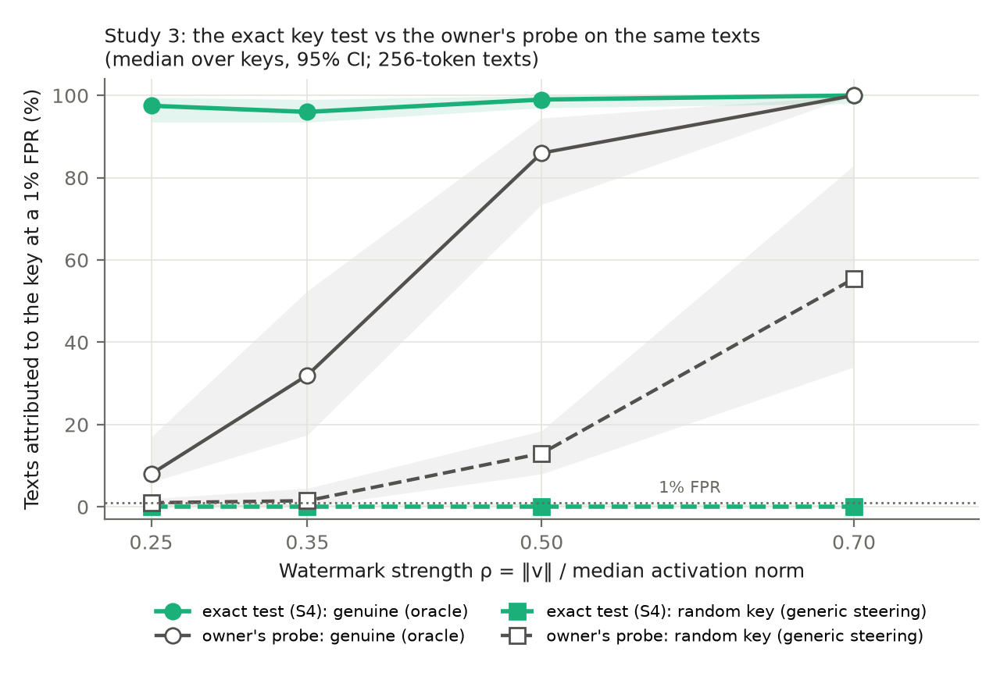
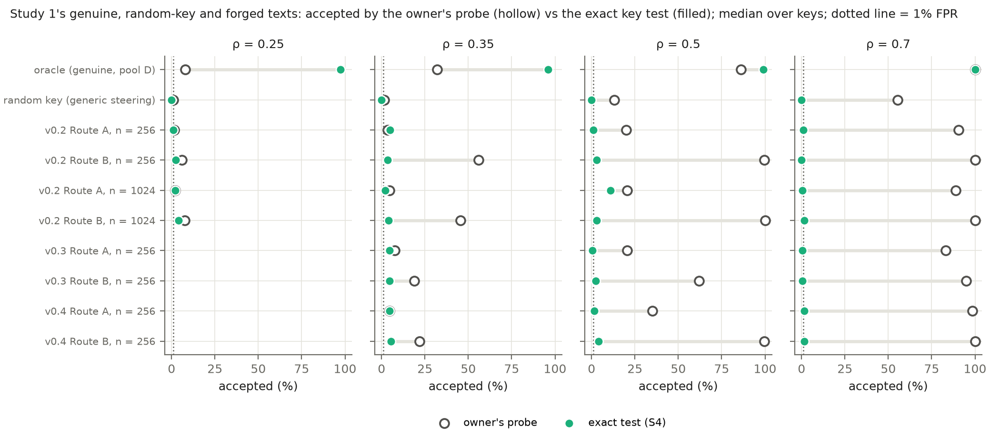
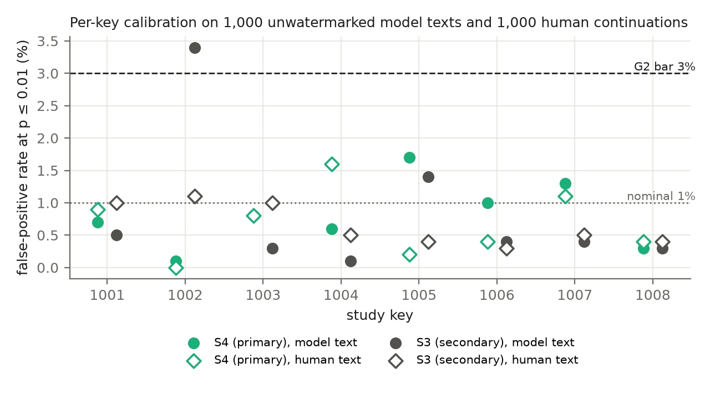
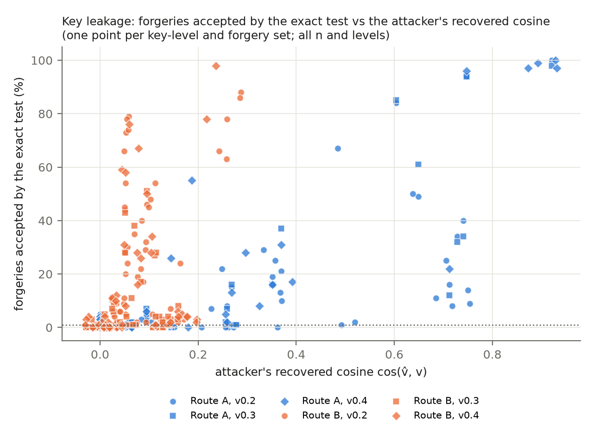

# Study 3 — report v0.1: exact key tests for an activation-steering watermark (Qwen2.5-1.5B)

Date: 2026-09-30 (Milestone 5). Protocol: [`STUDY3_PROTOCOL_v0.1.md`](STUDY3_PROTOCOL_v0.1.md) (LOCKED 2026-09-30 14:29 UTC, before outcomes). Lock: [`outputs/study3_v0.1/PRE_RUN_LOCK.json`](outputs/study3_v0.1/PRE_RUN_LOCK.json). Run manifest: [`outputs/study3_v0.1/RUN_MANIFEST.json`](outputs/study3_v0.1/RUN_MANIFEST.json). Results: [`outputs/study3_v0.1/results.json`](outputs/study3_v0.1/results.json). **This file is built by** `study3_report/make_report_s3.py`, **which inserts the tables and every number in the text from the locked outputs; no number is typed by hand.** Figures: `outputs/study3_v0.1/report/`.

## 1. Run
- Started 19:54 UTC (14:54 Central) after a Mac restart (swap 0); finished 22:48 UTC (17:48 Central); 10,468 s (2.9 h) against the 3.3 h projection. Phases F and R ran in one go, with no restart or crash.
- `check_lock()` accepted the lock before the start and again after the run (protocol, code, the 562 reused Study 1 files and the human texts unchanged). The holdout was not touched (`final: false`). No deviation from the protocol.
- The report builder re-computed, with its own implementation of the S4 test, every key's false-positive rate on the model and human null texts, every key's detection rate on genuine texts at every level, and the probe's acceptance of the genuine texts, and asserted that they equal `results.json` (all equal).

## 2. Pre-registered results (protocol §7)
### Table 1 — Pre-registered rules vs observed (protocol §7), with Study 1's verdicts under the probe on the same texts

**G1** (pooled FPR on pool A's 1,000 unwatermarked texts × 8 keys, pass if 0.3–2.5%): 0.81% → **PASS**. **G2** (a key is calibrated if its FPR ≤ 3.0%): 8 of 8 calibrated → **PASS** (per-key FPR: 1001 0.7%, 1002 0.1%, 1003 0.8%, 1004 0.6%, 1005 1.7%, 1006 1.0%, 1007 1.3%, 1008 0.3%).

| ρ | P1 oracle TPR, exact (≥ 20%) | E1 exact − probe TPR, median [95% CI] | E1 verdict | X1 Route A (exact) | X1 Route B (exact) | X3 (exact) | Study 1 v0.4 F1 A / B (probe) | Study 1 v0.4 F3 (probe) |
|---|---|---|---|---|---|---|---|---|
| 0.25 | 97.5% (pass) | +86.0 [80.5, 90.0] | exact test more powerful | n/a (no v0.4 forgeries at 0.25) | n/a (no v0.4 forgeries at 0.25) | no | — | — |
| 0.35 | 96.0% (pass) | +62.0 [46.0, 78.0] | exact test more powerful | not practical | not practical | no | not practical / practical (n=256) | no |
| 0.5 | 99.0% (pass) | +13.5 [3.0, 25.5] | exact test more powerful | not practical | not practical | no | inconclusive / inconclusive | no |
| 0.7 | 100.0% (pass) | +0.0 [-2.0, 0.0] | no clear difference | not practical | not practical | no | inconclusive / inconclusive | no |

X1 and X3 use exact-FA: accepted by the exact test (S4, p ≤ 0.01) **and** fluent by v0.4's definition (perplexity and seq-rep-4 at most the key-level oracle's 95th percentiles). Forms as v0.4's F1 and F3; bar = 50% of the oracle's median exact-FA: ρ = 0.25: 44.0%; ρ = 0.35: 43.2%; ρ = 0.5: 45.0%; ρ = 0.7: 45.0%.

**In words (evidence):**
- **G1 passes** (0.81% pooled) and **G2 passes**: all 8 keys are calibrated (per-key false-positive rates 0.1–1.7%).
- **P1 passes at every level**, including ρ = 0.25, where the owner's probe failed Study 1's working-watermark gate.
- **E1: the exact test is more powerful than the probe at ρ = 0.25, 0.35 and 0.50.** The median per-key differences are +86.0, +62.0 and +13.5 points (95% intervals [80.5, 90.0], [46.0, 78.0], [3.0, 25.5]). At ρ = 0.70 there is **no clear difference**: both detect 100.0% of genuine texts (median).
- **X1: fluent forgery is not practical against the exact test, for both routes, at ρ = 0.35, 0.50 and 0.70.** The median exact fluent acceptance of v0.4's forgeries is 0.0–4.5%, against bars of 43.2–45.0%. At ρ = 0.35 the same v0.4 Route B forgeries (n = 256) were *practical* against the probe in Study 1 (fluent acceptance 19.5%); under the exact test they reach 4.5%.
- **X3: no, at every level.** Random-key texts are attributed to the key at a median of 0.0% at all four levels, against the probe's 1.0%, 1.5%, 13.0% and 55.5% on the same texts.
- **Narrowest margin (stated plainly):** Route A at ρ = 0.7, n = 64: upper 95% bound 42.0% against the bar 45.0%. The verdict is "not practical" by the rule; the interval is wide because the per-key rates are bimodal (§4).
- **Materiality:** for the median key, fluent forgeries are accepted far below 50% of the genuine fluent rate (86.5%, 90.0% and 90.0% at the three levels). By the pre-registered standard, the exact test keeps the watermark's value as provenance evidence against these passive forgers.

## 3. Figures and tables

### Table 2 — Per-key false-positive rates at p ≤ 0.01 (%): S4 (primary) and S3 (secondary), on pool A's 1,000 unwatermarked model texts and its 1,000 human continuations

| statistic | null set | 1001 | 1002 | 1003 | 1004 | 1005 | 1006 | 1007 | 1008 | pooled | keys > 3.0% |
|---|---|---|---|---|---|---|---|---|---|---|---|
| S4 | model | 0.7 | 0.1 | 0.8 | 0.6 | 1.7 | 1.0 | 1.3 | 0.3 | 0.81 | 0 |
| S4 | human | 0.9 | 0.0 | 0.8 | 1.6 | 0.2 | 0.4 | 1.1 | 0.4 | 0.68 | 0 |
| S3 | model | 0.5 | 3.4 | 0.3 | 0.1 | 1.4 | 0.4 | 0.4 | 0.3 | 0.85 | 1 |
| S3 | human | 1.0 | 1.1 | 1.0 | 0.5 | 0.4 | 0.3 | 0.5 | 0.4 | 0.65 | 0 |

At p ≤ 0.001 with 9,999 null keys (S4, secondary): pooled FPR 0.11% (model), 0.05% (human). The owner's probe on the human continuations of pool A2 (Study 1 v0.2): 3.6% pooled.

### Table 3 — Acceptance by the owner's probe and by the exact test on the same texts (median over calibrated keys, %; exact with 95% cluster-bootstrap CI), and fluent acceptance (FA, v0.4 definition)

| ρ | texts | probe accepts | exact accepts [95% CI] | probe FA | exact FA [95% CI] | both accept | either accepts |
|---|---|---|---|---|---|---|---|
| 0.25 | oracle (genuine, pool D) | 8.0 | 97.5 [93.5, 99.5] | 8.0 | 88.0 [84.5, 90.5] | 8.0 | 97.5 |
| 0.25 | genuine, pool E (200) | — | 97.0 [95.0, 98.0] | — | — | — | — |
| 0.25 | random key (generic steering) | 1.0 | 0.0 [0.0, 0.5] | 1.0 | 0.0 [0.0, 0.5] | 0.0 | 1.0 |
| 0.25 | v0.2 Route A, n = 64 | 2.5 | 1.5 [0.0, 4.5] | 2.5 | 1.5 [0.0, 4.0] | 0.0 | 5.0 |
| 0.25 | v0.2 Route A, n = 256 | 1.5 | 1.0 [0.0, 6.5] | 1.5 | 1.0 [0.0, 6.0] | 0.0 | 4.5 |
| 0.25 | v0.2 Route A, n = 1024 | 2.0 | 2.0 [0.0, 8.5] | 2.0 | 1.5 [0.0, 8.0] | 0.0 | 6.0 |
| 0.25 | v0.2 Route B, n = 64 | 3.0 | 1.0 [0.0, 15.5] | 1.0 | 1.0 [0.0, 13.5] | 0.0 | 5.5 |
| 0.25 | v0.2 Route B, n = 256 | 6.0 | 2.5 [0.0, 21.5] | 2.5 | 2.0 [0.0, 11.0] | 0.0 | 7.0 |
| 0.25 | v0.2 Route B, n = 1024 | 7.5 | 4.0 [0.0, 26.0] | 3.0 | 3.0 [0.0, 15.0] | 0.0 | 13.0 |
| 0.35 | oracle (genuine, pool D) | 32.0 | 96.0 [93.5, 99.0] | 28.5 | 86.5 [84.0, 90.5] | 31.5 | 97.0 |
| 0.35 | genuine, pool E (200) | — | 97.8 [96.5, 99.2] | — | — | — | — |
| 0.35 | random key (generic steering) | 1.5 | 0.0 [0.0, 0.5] | 1.0 | 0.0 [0.0, 0.5] | 0.0 | 2.0 |
| 0.35 | v0.2 Route A, n = 64 | 11.0 | 1.5 [0.0, 81.0] | 7.0 | 0.5 [0.0, 43.0] | 0.0 | 18.5 |
| 0.35 | v0.2 Route A, n = 256 | 3.5 | 5.0 [0.0, 15.5] | 3.0 | 5.0 [0.0, 15.0] | 0.0 | 13.5 |
| 0.35 | v0.2 Route A, n = 1024 | 4.5 | 2.0 [0.0, 11.5] | 4.0 | 1.5 [0.0, 12.0] | 0.0 | 10.5 |
| 0.35 | v0.2 Route B, n = 64 | 42.5 | 0.5 [0.0, 24.5] | 0.0 | 0.5 [0.0, 12.5] | 0.0 | 53.0 |
| 0.35 | v0.2 Route B, n = 256 | 56.0 | 3.5 [0.0, 36.0] | 9.0 | 1.5 [0.0, 16.5] | 2.5 | 66.5 |
| 0.35 | v0.2 Route B, n = 1024 | 45.5 | 4.0 [0.0, 41.0] | 6.5 | 2.0 [0.0, 18.5] | 2.0 | 60.5 |
| 0.35 | v0.3 Route A, n = 64 | 9.5 | 2.0 [0.0, 80.5] | 4.5 | 2.0 [0.0, 44.5] | 0.0 | 19.0 |
| 0.35 | v0.3 Route A, n = 256 | 7.5 | 4.5 [0.0, 14.0] | 6.0 | 3.5 [0.0, 12.5] | 0.0 | 14.5 |
| 0.35 | v0.3 Route B, n = 64 | 20.5 | 4.0 [0.0, 20.0] | 8.0 | 4.0 [0.0, 13.5] | 0.5 | 25.0 |
| 0.35 | v0.3 Route B, n = 256 | 19.0 | 4.5 [0.0, 38.5] | 13.0 | 4.0 [0.0, 17.0] | 2.0 | 35.5 |
| 0.35 | v0.4 Route A, n = 64 | 4.0 | 2.5 [0.0, 14.5] | 4.0 | 2.5 [0.0, 14.5] | 0.5 | 13.5 |
| 0.35 | v0.4 Route A, n = 256 | 4.5 | 4.5 [0.0, 15.5] | 4.5 | 4.5 [0.0, 14.0] | 0.0 | 11.5 |
| 0.35 | v0.4 Route B, n = 64 | 10.5 | 1.0 [0.0, 18.5] | 9.5 | 0.0 [0.0, 10.0] | 0.0 | 13.5 |
| 0.35 | v0.4 Route B, n = 256 | 22.0 | 5.5 [1.5, 12.0] | 19.5 | 4.5 [1.5, 8.0] | 1.5 | 30.0 |
| 0.5 | oracle (genuine, pool D) | 86.0 | 99.0 [97.0, 100.0] | 77.0 | 90.0 [87.0, 92.5] | 85.5 | 99.5 |
| 0.5 | genuine, pool E (200) | — | 99.2 [97.5, 100.0] | — | — | — | — |
| 0.5 | random key (generic steering) | 13.0 | 0.0 [0.0, 1.0] | 10.0 | 0.0 [0.0, 1.0] | 0.0 | 14.0 |
| 0.5 | v0.2 Route A, n = 64 | 23.0 | 2.0 [0.0, 8.0] | 22.0 | 1.5 [0.0, 7.0] | 0.0 | 34.0 |
| 0.5 | v0.2 Route A, n = 256 | 20.0 | 1.0 [0.0, 17.0] | 13.0 | 1.0 [0.0, 17.5] | 0.0 | 27.0 |
| 0.5 | v0.2 Route A, n = 1024 | 20.5 | 11.0 [0.0, 29.5] | 10.5 | 10.5 [0.0, 29.0] | 0.0 | 33.5 |
| 0.5 | v0.2 Route B, n = 64 | 99.0 | 3.5 [0.0, 27.5] | 7.0 | 1.0 [0.0, 3.5] | 0.5 | 99.5 |
| 0.5 | v0.2 Route B, n = 256 | 99.5 | 3.0 [0.0, 46.5] | 3.0 | 0.0 [0.0, 5.0] | 3.0 | 99.5 |
| 0.5 | v0.2 Route B, n = 1024 | 100.0 | 3.0 [0.0, 68.5] | 1.5 | 0.0 [0.0, 7.5] | 3.0 | 100.0 |
| 0.5 | v0.3 Route A, n = 64 | 21.0 | 1.0 [0.0, 7.0] | 10.5 | 0.5 [0.0, 6.5] | 0.5 | 28.5 |
| 0.5 | v0.3 Route A, n = 256 | 20.5 | 0.5 [0.0, 18.5] | 14.5 | 0.5 [0.0, 24.0] | 0.0 | 21.5 |
| 0.5 | v0.3 Route B, n = 64 | 58.5 | 2.5 [0.0, 7.0] | 24.5 | 0.5 [0.0, 4.0] | 0.5 | 58.5 |
| 0.5 | v0.3 Route B, n = 256 | 62.0 | 2.5 [0.0, 11.5] | 10.0 | 1.0 [0.0, 4.0] | 1.5 | 62.0 |
| 0.5 | v0.4 Route A, n = 64 | 30.0 | 2.0 [0.5, 4.5] | 28.5 | 1.5 [0.0, 4.0] | 0.0 | 31.5 |
| 0.5 | v0.4 Route A, n = 256 | 35.0 | 1.5 [0.0, 33.0] | 26.0 | 1.5 [0.0, 32.5] | 0.5 | 47.5 |
| 0.5 | v0.4 Route B, n = 64 | 99.0 | 3.0 [0.0, 25.0] | 23.5 | 2.5 [0.5, 5.0] | 1.0 | 99.0 |
| 0.5 | v0.4 Route B, n = 256 | 99.5 | 4.0 [0.0, 29.5] | 26.5 | 3.5 [0.0, 9.5] | 2.5 | 100.0 |
| 0.7 | oracle (genuine, pool D) | 100.0 | 100.0 [98.0, 100.0] | 90.0 | 90.0 [86.0, 93.5] | 99.5 | 100.0 |
| 0.7 | genuine, pool E (200) | — | 99.2 [97.8, 100.0] | — | — | — | — |
| 0.7 | random key (generic steering) | 55.5 | 0.0 [0.0, 0.5] | 36.5 | 0.0 [0.0, 1.0] | 0.0 | 55.5 |
| 0.7 | v0.2 Route A, n = 64 | 80.5 | 0.0 [0.0, 3.5] | 13.0 | 0.0 [0.0, 2.5] | 0.0 | 80.5 |
| 0.7 | v0.2 Route A, n = 256 | 90.5 | 1.0 [0.0, 3.0] | 19.5 | 0.5 [0.0, 2.5] | 1.0 | 91.0 |
| 0.7 | v0.2 Route A, n = 1024 | 89.0 | 0.5 [0.0, 2.5] | 12.5 | 0.0 [0.0, 1.0] | 0.5 | 89.0 |
| 0.7 | v0.2 Route B, n = 64 | 100.0 | 0.5 [0.0, 60.0] | 0.5 | 0.0 [0.0, 2.0] | 0.5 | 100.0 |
| 0.7 | v0.2 Route B, n = 256 | 100.0 | 0.0 [0.0, 68.0] | 1.0 | 0.0 [0.0, 4.0] | 0.0 | 100.0 |
| 0.7 | v0.2 Route B, n = 1024 | 100.0 | 1.5 [0.0, 56.5] | 0.5 | 0.0 [0.0, 1.0] | 1.5 | 100.0 |
| 0.7 | v0.3 Route A, n = 64 | 75.5 | 0.0 [0.0, 0.5] | 15.0 | 0.0 [0.0, 0.0] | 0.0 | 75.5 |
| 0.7 | v0.3 Route A, n = 256 | 83.0 | 0.5 [0.0, 3.5] | 33.0 | 0.0 [0.0, 3.0] | 0.5 | 83.0 |
| 0.7 | v0.3 Route B, n = 64 | 94.0 | 0.0 [0.0, 1.5] | 2.5 | 0.0 [0.0, 0.0] | 0.0 | 94.0 |
| 0.7 | v0.3 Route B, n = 256 | 95.0 | 0.5 [0.0, 2.5] | 3.0 | 0.0 [0.0, 1.0] | 0.5 | 95.0 |
| 0.7 | v0.4 Route A, n = 64 | 94.5 | 1.5 [0.0, 51.0] | 36.5 | 1.0 [0.0, 42.0] | 0.5 | 95.5 |
| 0.7 | v0.4 Route A, n = 256 | 98.5 | 1.5 [0.0, 23.0] | 73.0 | 1.0 [0.0, 22.0] | 1.5 | 99.0 |
| 0.7 | v0.4 Route B, n = 64 | 100.0 | 3.0 [0.0, 48.0] | 25.5 | 1.0 [0.0, 4.0] | 3.0 | 100.0 |
| 0.7 | v0.4 Route B, n = 256 | 100.0 | 1.5 [0.0, 52.6] | 30.0 | 1.0 [0.0, 4.0] | 1.5 | 100.0 |

FPR of the joint detectors on pool A2 (the probe's own check set; median over calibrated keys): ρ = 0.25: both 0.0%, either 1.9%; ρ = 0.35: both 0.0%, either 1.5%; ρ = 0.5: both 0.0%, either 2.7%; ρ = 0.7: both 0.0%, either 2.6%.

### Table 4 — Key-leakage lens (secondary): forgeries' exact p-values, pooled tests, and the attacker's recovered cosine (median over calibrated keys, %)

| ρ | forgeries | exact accepts (p ≤ 0.01) | p ≤ 0.05 | p ≤ 0.10 | 4 texts pooled: detected | at p ≤ 0.001 (M = 9,999) | median cos(v̂, v) |
|---|---|---|---|---|---|---|---|
| 0.25 | v0.2 Route A, n = 64 | 1.5 | 5.5 | 12.0 | 0.0 | 0.0 | 0.000 |
| 0.25 | v0.2 Route A, n = 256 | 1.0 | 6.5 | 14.0 | 6.0 | 0.0 | 0.124 |
| 0.25 | v0.2 Route A, n = 1024 | 2.0 | 9.0 | 17.0 | 4.0 | 0.0 | 0.160 |
| 0.25 | v0.2 Route B, n = 64 | 1.0 | 9.5 | 18.0 | 0.0 | 0.0 | 0.042 |
| 0.25 | v0.2 Route B, n = 256 | 2.5 | 13.5 | 24.5 | 6.0 | 0.0 | 0.045 |
| 0.25 | v0.2 Route B, n = 1024 | 4.0 | 20.5 | 30.5 | 8.0 | 0.0 | 0.054 |
| 0.25 | random key (generic steering) | 0.0 | 2.0 | 6.0 | 0.0 | 0.0 | — |
| 0.25 | oracle (genuine, pool D) | 97.5 | 99.0 | 100.0 | 100.0 | 85.0 | — |
| 0.35 | v0.2 Route A, n = 64 | 1.5 | 7.5 | 15.5 | 2.0 | 0.5 | 0.105 |
| 0.35 | v0.2 Route A, n = 256 | 5.0 | 12.5 | 25.5 | 12.0 | 0.0 | 0.079 |
| 0.35 | v0.2 Route A, n = 1024 | 2.0 | 8.0 | 16.0 | 2.0 | 0.0 | 0.074 |
| 0.35 | v0.2 Route B, n = 64 | 0.5 | 9.0 | 17.0 | 0.0 | 0.0 | 0.036 |
| 0.35 | v0.2 Route B, n = 256 | 3.5 | 22.0 | 41.0 | 8.0 | 0.0 | 0.050 |
| 0.35 | v0.2 Route B, n = 1024 | 4.0 | 23.5 | 41.5 | 6.0 | 0.5 | 0.050 |
| 0.35 | v0.3 Route A, n = 64 | 2.0 | 7.0 | 14.5 | 2.0 | 0.0 | 0.105 |
| 0.35 | v0.3 Route A, n = 256 | 4.5 | 13.5 | 21.5 | 4.0 | 0.0 | 0.079 |
| 0.35 | v0.3 Route B, n = 64 | 4.0 | 13.0 | 22.0 | 0.0 | 0.0 | 0.043 |
| 0.35 | v0.3 Route B, n = 256 | 4.5 | 17.5 | 32.0 | 8.0 | 0.0 | 0.040 |
| 0.35 | v0.4 Route A, n = 64 | 2.5 | 6.5 | 15.0 | 4.0 | 0.5 | 0.163 |
| 0.35 | v0.4 Route A, n = 256 | 4.5 | 14.0 | 23.0 | 0.0 | 0.0 | 0.079 |
| 0.35 | v0.4 Route B, n = 64 | 1.0 | 6.5 | 17.0 | 0.0 | 0.0 | 0.042 |
| 0.35 | v0.4 Route B, n = 256 | 5.5 | 17.0 | 34.0 | 10.0 | 0.0 | 0.047 |
| 0.35 | random key (generic steering) | 0.0 | 3.5 | 7.5 | 0.0 | 0.0 | — |
| 0.35 | oracle (genuine, pool D) | 96.0 | 98.5 | 99.5 | 100.0 | 93.0 | — |
| 0.5 | v0.2 Route A, n = 64 | 2.0 | 8.0 | 14.5 | 4.0 | 0.0 | 0.000 |
| 0.5 | v0.2 Route A, n = 256 | 1.0 | 5.0 | 10.0 | 0.0 | 0.0 | 0.000 |
| 0.5 | v0.2 Route A, n = 1024 | 11.0 | 27.5 | 40.0 | 38.0 | 2.0 | 0.151 |
| 0.5 | v0.2 Route B, n = 64 | 3.5 | 7.0 | 14.0 | 0.0 | 0.0 | 0.037 |
| 0.5 | v0.2 Route B, n = 256 | 3.0 | 15.0 | 22.5 | 6.0 | 0.0 | 0.046 |
| 0.5 | v0.2 Route B, n = 1024 | 3.0 | 15.5 | 29.5 | 0.0 | 0.0 | 0.047 |
| 0.5 | v0.3 Route A, n = 64 | 1.0 | 6.0 | 13.5 | 0.0 | 0.0 | 0.000 |
| 0.5 | v0.3 Route A, n = 256 | 0.5 | 3.5 | 13.0 | 0.0 | 0.0 | 0.000 |
| 0.5 | v0.3 Route B, n = 64 | 2.5 | 10.0 | 21.5 | 2.0 | 0.0 | 0.032 |
| 0.5 | v0.3 Route B, n = 256 | 2.5 | 14.5 | 25.5 | 2.0 | 0.0 | 0.040 |
| 0.5 | v0.4 Route A, n = 64 | 2.0 | 10.0 | 18.5 | 0.0 | 0.0 | 0.000 |
| 0.5 | v0.4 Route A, n = 256 | 1.5 | 9.0 | 20.0 | 4.0 | 0.0 | 0.052 |
| 0.5 | v0.4 Route B, n = 64 | 3.0 | 20.5 | 36.0 | 4.0 | 0.0 | 0.035 |
| 0.5 | v0.4 Route B, n = 256 | 4.0 | 20.0 | 33.0 | 6.0 | 0.5 | 0.042 |
| 0.5 | random key (generic steering) | 0.0 | 2.5 | 6.0 | 0.0 | 0.0 | — |
| 0.5 | oracle (genuine, pool D) | 99.0 | 99.0 | 99.0 | 100.0 | 98.5 | — |
| 0.7 | v0.2 Route A, n = 64 | 0.0 | 4.5 | 13.0 | 0.0 | 0.0 | 0.000 |
| 0.7 | v0.2 Route A, n = 256 | 1.0 | 5.5 | 12.5 | 0.0 | 0.0 | 0.000 |
| 0.7 | v0.2 Route A, n = 1024 | 0.5 | 3.0 | 11.0 | 0.0 | 0.0 | 0.015 |
| 0.7 | v0.2 Route B, n = 64 | 0.5 | 10.0 | 17.0 | 0.0 | 0.0 | 0.046 |
| 0.7 | v0.2 Route B, n = 256 | 0.0 | 6.5 | 15.0 | 0.0 | 0.0 | 0.044 |
| 0.7 | v0.2 Route B, n = 1024 | 1.5 | 4.0 | 15.0 | 0.0 | 0.0 | 0.043 |
| 0.7 | v0.3 Route A, n = 64 | 0.0 | 4.5 | 11.5 | 0.0 | 0.0 | 0.000 |
| 0.7 | v0.3 Route A, n = 256 | 0.5 | 2.5 | 8.0 | 0.0 | 0.0 | 0.000 |
| 0.7 | v0.3 Route B, n = 64 | 0.0 | 6.5 | 17.5 | 0.0 | 0.0 | 0.041 |
| 0.7 | v0.3 Route B, n = 256 | 0.5 | 7.0 | 15.0 | 0.0 | 0.0 | 0.043 |
| 0.7 | v0.4 Route A, n = 64 | 1.5 | 5.5 | 12.5 | 0.0 | 0.0 | 0.000 |
| 0.7 | v0.4 Route A, n = 256 | 1.5 | 9.5 | 20.0 | 0.0 | 0.0 | 0.000 |
| 0.7 | v0.4 Route B, n = 64 | 3.0 | 16.5 | 29.0 | 0.0 | 0.5 | 0.052 |
| 0.7 | v0.4 Route B, n = 256 | 1.5 | 12.0 | 26.0 | 0.0 | 0.0 | 0.062 |
| 0.7 | random key (generic steering) | 0.0 | 0.0 | 2.0 | 0.0 | 0.0 | — |
| 0.7 | oracle (genuine, pool D) | 100.0 | 100.0 | 100.0 | 100.0 | 98.0 | — |

Route A: Spearman correlation between the attacker's cos(v̂, v) and the forgery's exact acceptance, over all key-levels and forgery sets: 0.68 (n = 192; descriptive).

Route B: Spearman correlation between the attacker's cos(v̂, v) and the forgery's exact acceptance, over all key-levels and forgery sets: 0.56 (n = 192; descriptive).

### Table 5 — Secondary statistic S3 (unstandardised gradient) beside S4: headline numbers (median over the keys each statistic calibrates, %)

| ρ | statistic | calibrated keys | oracle TPR | random-key acceptance | v0.4 B n=256 exact FA | X1 A | X1 B |
|---|---|---|---|---|---|---|---|
| 0.25 | S4 | 8 | 97.5 | 0.0 | — | — | — |
| 0.25 | S3 | 7 | 96.0 | 0.0 | — | — | — |
| 0.35 | S4 | 8 | 96.0 | 0.0 | 4.5 | not practical | not practical |
| 0.35 | S3 | 7 | 95.0 | 0.0 | 3.0 | not practical | not practical |
| 0.5 | S4 | 8 | 99.0 | 0.0 | 3.5 | not practical | not practical |
| 0.5 | S3 | 7 | 99.0 | 0.0 | 4.0 | not practical | not practical |
| 0.7 | S4 | 8 | 100.0 | 0.0 | 1.0 | not practical | not practical |
| 0.7 | S3 | 7 | 100.0 | 0.0 | 2.0 | not practical | not practical |

### Table 6 — Per-key exact acceptance (%, S4), keys in calibrated order; the probe's beside it

| ρ | texts | detector | 1001 | 1002 | 1003 | 1004 | 1005 | 1006 | 1007 | 1008 |
|---|---|---|---|---|---|---|---|---|---|---|
| 0.25 | oracle (genuine, pool D) | exact | 99 | 91 | 98 | 98 | 100 | 93 | 95 | 97 |
| 0.25 | random key (generic steering) | exact | 0 | 0 | 0 | 0 | 1 | 1 | 0 | 1 |
| 0.25 | v0.2 Route A, n = 256 | exact | 0 | 0 | 4 | 8 | 10 | 0 | 2 | 0 |
| 0.25 | v0.2 Route B, n = 256 | exact | 1 | 9 | 24 | 3 | 2 | 40 | 0 | 0 |
| 0.35 | oracle (genuine, pool D) | exact | 100 | 95 | 95 | 98 | 96 | 88 | 98 | 96 |
| 0.35 | random key (generic steering) | exact | 2 | 0 | 0 | 0 | 0 | 2 | 0 | 0 |
| 0.35 | v0.4 Route A, n = 256 | exact | 0 | 0 | 6 | 22 | 16 | 13 | 1 | 3 |
| 0.35 | v0.4 Route B, n = 256 | exact | 2 | 1 | 8 | 6 | 5 | 50 | 12 | 2 |
| 0.5 | oracle (genuine, pool D) | exact | 100 | 95 | 99 | 98 | 100 | 99 | 100 | 97 |
| 0.5 | random key (generic steering) | exact | 1 | 0 | 0 | 0 | 0 | 2 | 2 | 0 |
| 0.5 | v0.4 Route A, n = 256 | exact | 1 | 0 | 28 | 97 | 31 | 1 | 1 | 2 |
| 0.5 | v0.4 Route B, n = 256 | exact | 0 | 0 | 58 | 4 | 4 | 34 | 10 | 4 |
| 0.7 | oracle (genuine, pool D) | exact | 100 | 41 | 100 | 100 | 100 | 98 | 100 | 99 |
| 0.7 | random key (generic steering) | exact | 0 | 0 | 0 | 0 | 0 | 4 | 1 | 0 |
| 0.7 | v0.4 Route A, n = 256 | exact | 0 | 0 | 26 | 100 | 2 | 3 | 0 | 1 |
| 0.7 | v0.4 Route B, n = 256 | exact | 1 | 0 | 67 | 98 | 2 | 26 | 0 | 1 |

## 4. Secondary results (pre-registered, descriptive)
- **Human text (H1):** pooled false-positive rate 0.68%, highest key 1.6%, no key above 3%. The owner's probe flagged 3.6% of human continuations in Study 1.
- **Stricter level (p ≤ 0.001, 9,999 null keys):** false-positive rate 0.11% on model text and 0.05% on human text; genuine texts detected at 85.0%, 93.0%, 98.5% and 98.0% at the four strengths.
- **Genuine texts of pool E** (200 per key-level): detected at 97.0%, 97.8%, 99.2% and 99.2%.
- **Probe and exact test combined:** requiring both flags 0.0% of pool A2's unwatermarked texts at every level (requiring either: 1.5–2.7%). "Both" inherits the probe's weak power at low strength, and "either" inherits the probe's acceptance of forgeries (Table 3), so neither beats the exact test alone.
- **S3 (unstandardised gradient):** 7 of 8 keys calibrated (key 1002 at 3.4%), as the pilot's per-key diagnosis predicted; the verdicts are otherwise the same (Table 5).
- **Key-leakage lens:**
  - On average, forgeries carry a weak key-specific signal: 8.0–41.5% of forgeries have p ≤ 0.10 (median over keys, per forgery set and level; 10% would be expected with no signal), against 2.0–7.5% of random-key texts.
  - The signal is concentrated in a few keys: 35 of 384 key-level × forgery-set cells have exact acceptance of 50% or more. For v0.4's forgeries at n = 256: B key 1006 at ρ = 0.35 (50%); A key 1004 at ρ = 0.5 (97%); B key 1003 at ρ = 0.5 (58%); A key 1004 at ρ = 0.7 (100%); B key 1003 at ρ = 0.7 (67%); B key 1004 at ρ = 0.7 (98%).
  - Exact acceptance rises with the attacker's recovered cosine (Spearman 0.68 for Route A, 0.56 for Route B, over all key-levels and forgery sets; Figure 4). Route A forgeries pass mainly where the attack recovered much of the key; some Route B forgeries pass at a cosine near zero.
  - Pooling 4 forged texts per test detects a median of 0.0% of batches across forgery sets; the highest is 38.0% (v0.2 Route A, n = 1024 at ρ = 0.5).

## 5. After the run (exploratory, labelled)
- **Key 1002 at ρ = 0.70:** its genuine texts are detected at 41%, while every other key reaches at least 98%. Their p-values sit just above the cut-off (median 0.017), and key 1002 also has the lowest false-positive rate (0.1%), so its test is conservative in both directions. Unexplained; it changes no verdict (the level's median detection is 100.0%).
- **Why some Route B forgeries pass (inference):** Route B does not estimate the key; it copies the average footprint of watermarked text, usually at another layer. For some keys that footprint evidently reproduces enough of the key's effect on the output distribution for the gradient test to see it, even though the copied vector points elsewhere (low cosine).
- **Figure layout, fixed after viewing:** Figure 1's "1% FPR" label was moved off the markers; Figure 4's title was shortened (it was clipped) and its legend moved below the plot (it covered points).

## 6. Reading (inference, not established)
- **The weak point in Study 1 was the detector, not the watermark.** Testing the key directly, the owner detects between 96.0% and 100.0% of genuine 256-token texts (median) at an exact 1% false-positive rate at every strength, including ρ = 0.25–0.35, where Study 1's calibration found the perplexity cost within its pre-set quality limit. The calibrations' "no detectable-and-fluent strength" was a limit of the probe.
- **Against Study 1's passive forgeries, the exact test holds for the median key,** and it rejects generic steering by construction. Study 1's one practical fluent forgery (v0.4 Route B at ρ = 0.35) is blocked.
- **The protection is only as good as the key's secrecy.** Where an attack recovered much of the key (Route A for key 1004 at high strength) or reproduced its signature (Route B for keys 1003, 1004 and 1006), forgeries passed for half or more of the texts. With at most 1,024 observed texts this is uncommon, but it happens, so key recovery matters again: it is now the route to beating the exact test.
- **For a deployer:** test the key, not the steering. The exact test has more power at low strength, a 1% false-positive rate checked per key, a lower false-positive rate on human text than the probe, and no acceptance of generic steering. Keep the key secret, and consider limiting what one key reveals across many texts (Study 5's rotating or context-keyed keys).
- **Not shown:** attackers who know the exact test and adapt to it; robustness to paraphrase or scrubbing (Study 2); other models, layers or text lengths.
