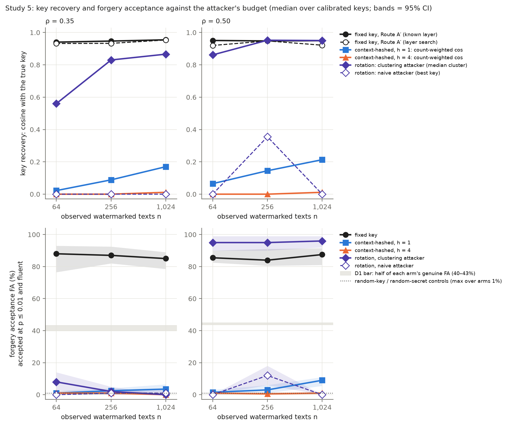
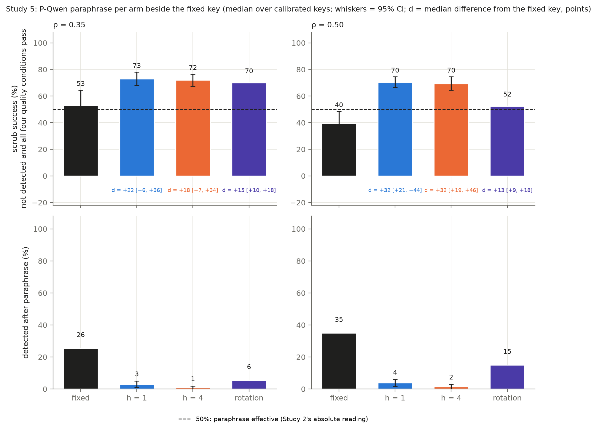
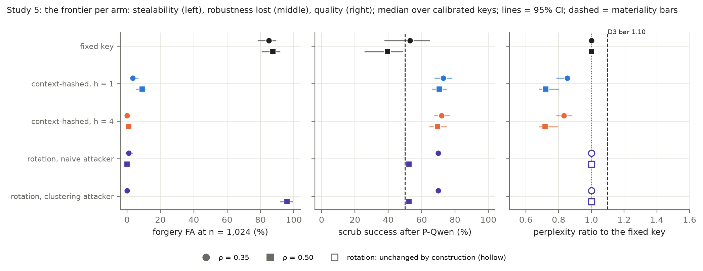
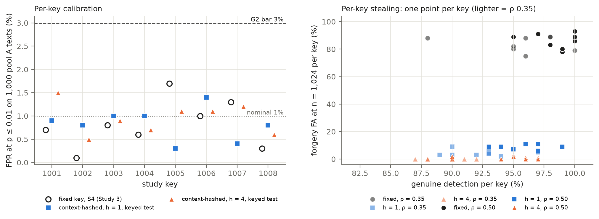
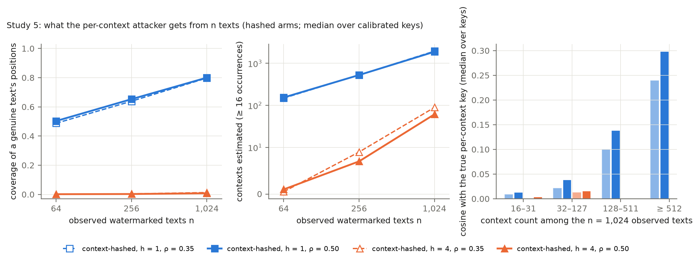

# Study 5 — report v0.1: context-keyed and rotating-key activation steering against the gradient-averaging attacker (Qwen2.5-1.5B)

Date: 2026-10-04 (Milestone 9). Protocol: [`STUDY5_PROTOCOL_v0.1.md`](STUDY5_PROTOCOL_v0.1.md) (LOCKED 2026-10-02 23:24 UTC (18:24 CDT), before outcomes). Lock: [`outputs/study5_v0.1/PRE_RUN_LOCK.json`](outputs/study5_v0.1/PRE_RUN_LOCK.json). Run manifest: [`outputs/study5_v0.1/RUN_MANIFEST.json`](outputs/study5_v0.1/RUN_MANIFEST.json). Results: [`outputs/study5_v0.1/results.json`](outputs/study5_v0.1/results.json). **This file is built by** `study5_report/make_report_s5.py`, **which inserts the tables, the samples and every number in the text from the locked outputs; no number is typed by hand.** The builder was written during phases S and K, before any Study 5 outcome was read, and tested on a synthetic fixture of the full scope (`study5_report/fixture_s5.py`). Figures: `outputs/study5_v0.1/report/`.

## 1. Run
- **Phases S and K (shared statistics; the keyed arms' generation, attacker, forgeries, controls and quality):** 2026-10-02 23:29 UTC (18:29 CDT) to 2026-10-03 18:04 UTC (13:04 CDT); S 0.2 h, K 18.4 h.
- **Phase P (P-Qwen paraphrase of the keyed arms' genuine texts, then scoring):** 2026-10-03 18:05–21:38 UTC (13:05–16:38 CDT), 3.6 h.
- **Phases F and R (the fixed key's re-attack with Route A′; rotation):** F 21:39–01:21 UTC (16:39–20:21 CDT), 3.7 h; R 01:21–01:48 UTC (20:21–20:48 CDT), 0.5 h; analysis 01:50–01:50 UTC, 0.0 h. Total 26.3 h against the 26.6 h projection.
- `check_lock()` accepted the lock before each phase and again after the run (the protocol, 18 code files and 106 reused files unchanged). The holdout was not touched (`final: false`). Deviations: none.
- The report builder re-computed, with its own implementation, S4 and the union test on Study 3's locked features (the fixed arm's detection, acceptance and random-key control; rotation's union-test detection) and on Study 2's locked paraphrases (the fixed key's scrub success, the D2 comparator, which also equals Study 2's reported S1 values), and, from the run's per-text keyed statistics, every p-value, fluency flag, acceptance, scrub success, quality condition and perplexity ratio per key. It re-derived G1, G2, P0, P1 and every D1, D2 and D3 verdict from the §9 rules written out again and asserted that all of these equal `results.json` (all equal). The per-position keyed statistics themselves are taken from the run's files (their gradients are not stored).

## 2. Pre-registered results (protocol §9)
### Table 1 — Pre-registered rules vs observed (protocol §9)

- **context-hashed, h = 1:** G1 pooled FPR over 8 secrets × 1,000 pool A texts 0.83% (pass if 0.3–2.5%) → **PASS**; G2 8 of 8 keys calibrated (FPR ≤ 3.0%) → verdicts **made**.
- **context-hashed, h = 4:** G1 pooled FPR over 8 secrets × 1,000 pool A texts 0.95% (pass if 0.3–2.5%) → **PASS**; G2 8 of 8 keys calibrated (FPR ≤ 3.0%) → verdicts **made**.
- **Union test (rotation):** G1 pooled FPR 1.00% → **PASS**.
- **P0, the threat at ρ = 0.35:** the fixed key under Route A′ is **practical (n=64)** (forgery FA at n = 64 / 256 / 1,024: 88.0 [76.5, 93.0] / 87.0 [82.0, 92.5] / 85.0 [78.5, 89.0]%, bar 43.2% = half the genuine FA 86.5%, random-key control 0.0 [0.0, 0.5]%) → defence verdicts at this strength are **made**.
- **P0, the threat at ρ = 0.50:** the fixed key under Route A′ is **practical (n=64)** (forgery FA at n = 64 / 256 / 1,024: 85.5 [82.5, 90.0] / 84.0 [80.5, 91.0] / 87.5 [81.0, 91.5]%, bar 45.0% = half the genuine FA 90.0%, random-key control 0.0 [0.0, 0.5]%) → defence verdicts at this strength are **made**.

| arm | ρ | P1: genuine detection, median [95% CI] (≥ 50%) | D1 stealing: forgery FA at n = 64 / 256 / 1,024 [95% CI]; bar; control → verdict | D2 robustness cost: scrub success [95% CI] vs the fixed key's; d = median difference [95% CI]; keys ≥ 20 pts → verdict (absolute reading) | D3 quality cost: perplexity ratio arm/fixed, median [95% CI]; keys > 1.10 → verdict |
|---|---|---|---|---|---|
| context-hashed, h = 1 | 0.35 | 92.5 [89.0, 94.5]% (pass) | 1.0 [0.0, 2.5] / 2.5 [0.0, 4.0] / 3.5 [2.0, 6.5]%; bar 42.0% (genuine FA 84.0%); control 1.0 [0.0, 1.5]% → **stealing blocked at n <= 1024** | 73.0 [68.0, 78.0]% vs 53.0 [38.0, 64.5]%; d = +22.0 [6.0, 36.5]; 5 of 8 → **material robustness cost** (paraphrase effective (>= 50%)) | 0.852 [0.790, 0.874]; 0 of 8 → **immaterial** |
| context-hashed, h = 1 | 0.50 | 96.5 [94.0, 98.5]% (pass) | 1.5 [0.0, 3.0] / 3.0 [1.0, 6.0] / 9.0 [5.5, 11.0]%; bar 44.0% (genuine FA 88.0%); control 1.0 [0.0, 1.0]% → **stealing blocked at n <= 1024** | 70.5 [66.5, 74.5]% vs 39.5 [26.0, 48.5]%; d = +32.0 [21.0, 44.0]; 7 of 8 → **material robustness cost** (paraphrase effective (>= 50%)) | 0.722 [0.682, 0.799]; 0 of 8 → **immaterial** |
| context-hashed, h = 4 | 0.35 | 90.0 [87.0, 92.5]% (pass) | 1.0 [0.0, 2.5] / 1.0 [0.0, 2.0] / 0.0 [0.0, 0.0]%; bar 40.0% (genuine FA 80.0%); control 0.5 [0.0, 1.5]% → **stealing blocked at n <= 1024** | 72.0 [67.5, 76.5]% vs 53.0 [38.0, 64.5]%; d = +18.0 [7.5, 33.5]; 3 of 8 → **inconclusive** (paraphrase effective (>= 50%)) | 0.832 [0.787, 0.879]; 0 of 8 → **immaterial** |
| context-hashed, h = 4 | 0.50 | 95.5 [93.0, 97.5]% (pass) | 1.0 [0.0, 2.0] / 0.5 [0.0, 1.5] / 1.0 [0.0, 2.0]%; bar 43.8% (genuine FA 87.5%); control 0.5 [0.0, 1.5]% → **stealing blocked at n <= 1024** | 69.5 [64.5, 74.5]% vs 39.5 [26.0, 48.5]%; d = +32.5 [19.0, 45.5]; 7 of 8 → **material robustness cost** (paraphrase effective (>= 50%)) | 0.717 [0.686, 0.791]; 0 of 8 → **immaterial** |
| rotation (K = 8) | 0.35 | union test 93.0 [87.5, 96.5]% (pass; told which key: 96.0 [93.5, 99.0]%) | naive: 0.0 [0.0, 0.0] / 1.0 [0.0, 3.0] / 1.0 [0.0, 3.0]% → **stealing blocked at n <= 1024**; cluster: 8.0 [3.0, 14.0] / 2.0 [0.0, 5.0] / 0.0 [0.0, 0.0]% → **stealing blocked at n <= 1024**; bar 43.2% (the fixed oracle FA 86.5%); control 0.0 [0.0, 0.5]% | union-test success on Study 2's paraphrases 70.0% vs 53.0 [38.0, 64.5]%; d = +15.0 [9.5, 18.5] → **immaterial** | unchanged by construction (not tested) |
| rotation (K = 8) | 0.50 | union test 98.5 [95.0, 100.0]% (pass; told which key: 99.0 [97.0, 100.0]%) | naive: 0.0 [0.0, 0.0] / 12.0 [6.0, 18.0] / 0.0 [0.0, 0.0]% → **stealing blocked at n <= 1024**; cluster: 95.0 [90.0, 99.0] / 95.0 [90.0, 99.0] / 96.0 [92.0, 99.0]% → **practical (n=64)**; bar 45.0% (the fixed oracle FA 90.0%); control 0.0 [0.0, 0.5]% | union-test success on Study 2's paraphrases 52.5% vs 39.5 [26.0, 48.5]%; d = +13.0 [8.5, 17.5] → **immaterial** | unchanged by construction (not tested) |

FA = accepted at p ≤ 0.01 **and** fluent (perplexity and seq-rep-4 at most the arm's own genuine texts' 95th percentiles at that key-level; rotation: the level's pooled oracle percentiles). Scrub success = not detected at p ≤ 0.01 **and** Study 2's four quality conditions (fluency, repetition, length, meaning; the owner's bars). Medians over calibrated keys with 95% cluster-bootstrap intervals (keys, then texts); D2's interval is paired (the same keys and prompts). The fixed key's scrub success is Study 2's P-Qwen result on the same prompts and keys, re-computed here from Study 2's locked paraphrases.

**In words (evidence; every number is filled from `results.json` and the locked per-text files):**
- **Gates.** G1 passes for both hashed arms (pooled FPR on the 1,000 pool A null texts 0.83% for h = 1 and 0.95% for h = 4, against 0.3–2.5%) and for the union test (1.00%). G2: all 8 of 8 keys are calibrated for h = 1 (per-key FPR 0.3–1.4%) and all 8 for h = 4 (0.5–1.5%), so every verdict is made. P1 passes everywhere: the keyed test detects 92.5% and 96.5% of the h = 1 genuine texts at ρ = 0.35 and 0.50, 90.0% and 95.5% of the h = 4 texts, and the union test 93.0 [87.5, 96.5]% and 98.5 [95.0, 100.0]% of the rotating corpus (against 96.0 [93.5, 99.0]% and 99.0 [97.0, 100.0]% when told which key).
- **P0, the threat is real on the study keys.** The fixed key under Route A′ is **practical (n=64)** at ρ = 0.35 and **practical (n=64)** at 0.50: from 64 observed texts the attacker recovers the key at a median cosine of 0.94 (layer given) and 0.93 (layer searched; layer 14 found for 6 of 8 keys) at ρ = 0.35, and its fluent forgeries are accepted 88.0 [76.5, 93.0]% of the time, as often as the owner's own genuine texts (86.5 [83.5, 90.5]%; bar 43.2%); at ρ = 0.50 85.5 [82.5, 90.0]% against 90.0 [87.0, 92.5]%. More texts change nothing (85.0% and 87.5% at n = 1,024; every key between 78% and 93% at 0.50). The random-key control is accepted 0.0 [0.0, 0.5]% and 0.0 [0.0, 0.5]%. Study 1's activation estimator recovered nothing from the same 1,024 texts; the exact test's own statistic recovers everything from 64.
- **D1, stealing: both hashed arms block this attacker at n ≤ 1,024.** h = 1: forgery FA 1.0 [0.0, 2.5] / 2.5 [0.0, 4.0] / 3.5 [2.0, 6.5]% at n = 64 / 256 / 1,024 at ρ = 0.35 and 1.5 [0.0, 3.0] / 3.0 [1.0, 6.0] / 9.0 [5.5, 11.0]% at 0.50, against bars of 42.0% and 44.0% (half the arms' genuine FA of 84.0 [79.5, 86.5]% and 88.0 [85.0, 90.5]%) → **stealing blocked at n <= 1024** at both strengths. h = 4: 1.0 [0.0, 2.5] / 1.0 [0.0, 2.0] / 0.0 [0.0, 0.0]% and 1.0 [0.0, 2.0] / 0.5 [0.0, 1.5] / 1.0 [0.0, 2.0]% → **stealing blocked at n <= 1024**. The random-secret controls are accepted at most 1.0 [0.0, 1.5]% (h = 1) and 0.5 [0.0, 1.5]% (h = 4). Per key, no key leaks: the h = 1 forgeries at n = 1,024 are accepted 5–11% at ρ = 0.50 and the h = 4 forgeries 0–3%.
- **D1, rotation (K = 8).** The naive attacker (Route A′ on the mixture) is **stealing blocked at n <= 1024** at both strengths (its best cosine with any key 0.00 / 0.00 / 0.00 at ρ = 0.35; one blip of 0.36 at n = 256, ρ = 0.50, with FA 12.0%). The clustering attacker is **practical (n=64)** at ρ = 0.50: it separates the mixture into the 8 keys (7 of 8 recovered at cosine ≥ 0.5 from 64 texts, 8 of 8 from 256) and its forgeries are accepted 95.0 / 95.0 / 96.0% (the forging cluster's cosine 0.95–0.96). At ρ = 0.35 its pre-registered verdict is **stealing blocked at n <= 1024** (FA 8.0 / 2.0 / 0.0%), but see "what drives the numbers": the attacker recovered 6 of 8 keys and only its rule for choosing the forging cluster failed.
- **D2, robustness cost: the hashed arms lose the paraphrase robustness the fixed key has.** After P-Qwen with the attacker's self-check, scrub success against h = 1 is 73.0 [68.0, 78.0]% at ρ = 0.35 and 70.5 [66.5, 74.5]% at 0.50, against the fixed key's 53.0 [38.0, 64.5]% and 39.5 [26.0, 48.5]% on the same prompts and keys (Study 2); the paired difference is d = +22.0 [6.0, 36.5] points (5 of 8 keys at or above 20) and d = +32.0 [21.0, 44.0] (7 of 8) → **material robustness cost** at both strengths. Against h = 4: 72.0 [67.5, 76.5]% and 69.5 [64.5, 74.5]%; d = +18.0 [7.5, 33.5] (3 of 8) → **inconclusive** at ρ = 0.35, and d = +32.5 [19.0, 45.5] (7 of 8) → **material robustness cost** at 0.50. Study 2's absolute reading is "paraphrase effective (>= 50%)" for every keyed arm at every strength, where the fixed key was scrubbed effectively only at ρ ≤ 0.35. Detection after paraphrase falls to 3.0% / 4.0% (h = 1) and 1.0% / 1.5% (h = 4), against the fixed key's 25.5% and 35.0%: the keyed arms keep almost no evidence, and four pooled paraphrases are detected only 4.0–8.0% (h = 1) and 0.0–4.0% (h = 4) of the time. Rotation's union test is weaker than the single-key test on Study 2's paraphrases: scrub success is +15.0 [9.5, 18.5] and +13.0 [8.5, 17.5] points higher under it → **immaterial**.
- **D3, quality: no cost; an improvement.** The keyed texts have *lower* perplexity than the fixed key's on the same prompts: the median ratio is 0.852 [0.790, 0.874] (h = 1) and 0.832 [0.787, 0.879] (h = 4) at ρ = 0.35, and 0.722 [0.682, 0.799] and 0.717 [0.686, 0.791] at 0.50 → **immaterial** everywhere, with 0 of 8 keys above 1.10 (per-key medians 0.61–0.82 for h = 1 at 0.50). Median seq-rep-4 is 0.0040 (h = 1) and 0.0000 (h = 4) against the fixed key's 0.0000 at 0.35. Rotation is unchanged by construction.
- **Bounds (protocol §9).** The D1 bar is relative to each arm's genuine FA (from 80.0% for h = 4 at ρ = 0.35 to 90.0% for the fixed key at 0.50), so the bars sit at 40.0–45.0% and no "practical" verdict is automatic; the controls never approach them, so "generic steering suffices" never triggers. The hashed arms' FA upper bounds stay at or below 11.0% at every n, far from the bars, so the "blocked" verdicts are not narrow.
- **Narrowest margins, stated plainly.** h = 4's robustness cost at ρ = 0.35 is "inconclusive" because its median difference (+18.0 points) falls just under the 20-point bar although its interval excludes zero; h = 1's at 0.35 clears the bar with a lower bound of only +6.0 points. Rotation's union-test reading is "immaterial" with upper bounds of 18.5 and 17.5 points, just under 20. h = 1's forgery acceptance rises with n at ρ = 0.50 (1.5 → 3.0 → 9.0%), with the attacker's count-weighted cosine at 0.213 and its coverage of a genuine text's positions at 0.800 by n = 1,024: the verdict is bounded by the budget, not by the scheme.
- **Materiality.** Keying the direction by the previous token removes the gradient-averaging attacker's foothold at this budget and improves quality, but it also removes most of the evidence that survives paraphrase: a deployer who keys the watermark trades a complete break at 64 texts for a watermark that an off-the-shelf paraphrase scrubs about 70.5% of the time at ρ = 0.50, where the fixed key was scrubbed 39.5%. Rotation keeps the fixed key's robustness and quality but only multiplies the attacker's cost: at ρ = 0.50 the clustering attacker breaks all 8 keys from 64 texts.

**What drives the numbers (descriptive; protocol §10):**
- **The per-context attacker is starved of data, not of signal.** With h = 1 the 1,024 observed texts hold 18,805 distinct one-token contexts of which 1,880 occur at least 16 times; the attacker estimates 1,878 contexts covering 0.800 of a genuine text's positions, but its estimates are poor (count-weighted cosine 0.213; Figure 5 shows the cosine rising with a context's count, to about 0.3 for contexts seen 512 times or more). With h = 4 the 242,542 distinct four-token contexts almost never repeat (61 eligible), so the attacker steers almost nothing (coverage 0.008). The fixed key is the h = 0 limit of the same curve: one context, 1,024 texts, cosine 0.95.
- **Rotation's "blocked" at ρ = 0.35 is the attacker's selection rule, not the defence.** The pre-registered forgery uses the cluster with the largest z-profile; at n = 256 and 1,024 that rule picked a small outlier cluster whose estimate has cosine 0.00 with any key (1001), while the other clusters recovered 6 of 8 keys (median best cosine 0.87). At ρ = 0.50 the same rule picked a cluster with cosine 0.96 (key 1004). The post-hoc addendum (§5, labelled) confirms it: forging with every cluster in turn reaches 96% at n = 256 and 90% at n = 1,024, the largest-cluster rule 88% and 89%, and 5 of the 6 clusters with cosine ≥ 0.5 reach the bar at n = 1,024; rotation falls to clustering at both strengths. The pre-registered verdict stands as written.
- **Scrub success against the keyed arms is capped by quality, not by detection.** The paraphrases evade the keyed test almost always (detected 1.0–4.0%), so success equals the share passing all four quality conditions (70.0–75.5%): fluency passes 97.0–99.0%, repetition 99.0–100.0%, length 86.0–90.5% and meaning 78.0–80.5%. Under the stricter bars success is 5.0–7.5% (model-text 95th percentile) and 23.0–31.5% (human median). The attacker's self-check kept 1012 first attempts, 361 second and 227 third of 1,600 for h = 1 (333, or 20.8%, still failing its own check after three), and 1055 / 331 / 214 for h = 4 (24.8% still failing).
- **Why the fixed key survives paraphrase and the keyed arms do not (inference).** The fixed key's evidence after paraphrase (35.0% detected at ρ = 0.50, 15.0% under the union test) comes from a content shift that a paraphrase preserves; the keyed test projects each position's gradient on the key of that position's own context, and a paraphrase changes most contexts, so the surviving shift no longer lines up with any key the owner can test. Pooling does not help (8.0% for h = 1 at 0.50). The same mechanism is what denies the attacker a stable direction to average.
- **Per key.** The fixed key's Study 2 scrub success ranges from 13% to 64% across keys at ρ = 0.50, while the keyed arms' success is uniform (67–74% for h = 1, 64–78% for h = 4), so D2's per-key differences follow the fixed key's spread. Detection per key is 93–99% (h = 1) and 90–97% (h = 4) at 0.50; the union test's lowest key is at 80%. Calibration after keying is tight (Table 5 and Figure 4).
- **Detection, thresholds and pooling.** At p ≤ 0.05 the keyed test detects 98.5% (h = 1) and 97.0% (h = 4) of the genuine texts at ρ = 0.35, and four pooled genuine texts are detected 100.0% of the time. The decode–encode round trip recovers 0.985 (h = 1) and 1.000 (h = 4) of the continuation token ids, so the owner re-derives the generation-time keys from the text alone, as the detector assumes.
- **Samples (§4; the readings there are generated).** For keys 1001 and 1002 at ρ = 0.50 the fixed key's Route A′ forgeries at n = 1,024 read as fluent sports copy and are accepted at p = 0.001 within the fluency bars; the h = 1 forgeries steer 214–219 of 256 positions on an estimate of cosine about 0.2 and are rejected (p = 0.057 and 0.117), the h = 4 forgeries steer 0–7 positions and are rejected; the keyed genuine texts read fluently with lower perplexity than the fixed key's text on the same prompt; the keyed arms' paraphrases are fluent and undetected (p = 0.19–0.77), and one fails only the meaning condition; rotation's clustering forgery is accepted at p = 0.001 and fluent.
- **Timing.** 26.3 h against the 26.6 h projection: keyed generation, attack and forgeries 18.4 h, paraphrase 3.6 h (3.30–3.43 s per original with retries), the fixed key's re-attack 3.7 h, rotation 0.5 h. No deviation.

**Interpretation (inference, for the claim gate; not a pre-registered result):**
- The gradient-averaging attacker makes the fixed-key scheme forgeable from 64 texts at the strengths where the exact test detects it and paraphrase does not scrub it. Context keying stops that attacker at n ≤ 1,024 and costs nothing in quality, but it gives up the paraphrase robustness, so the three-way trade-off of Studies 1–3 becomes the token-level no-free-lunch trade-off: the schemes that resist stealing are the schemes that paraphrase scrubs. Rotation among 8 keys keeps robustness and quality and buys only a constant factor against a clustering attacker.
- The claim is bounded by one attacker (per-context averaging with a 16-occurrence threshold, given the layer), one paraphraser, one model and n ≤ 1,024; the token-level literature steals context-hashed schemes with budgets ten times larger, and h = 1's rising acceptance curve points the same way.

## 3. Figures and tables

### Table 2 — Detection, quality and power per arm (median over calibrated keys; ρ by row)

| arm | ρ | genuine detection % [95% CI] | at p ≤ 0.05 / 0.10 | 4 texts pooled | genuine FA % | control FA % | perplexity: median keyed / median fixed; ratio | seq-rep-4 keyed / fixed | tokenisation round trip (ρ = 0.50) |
|---|---|---|---|---|---|---|---|---|---|
| fixed key (h = 0) (S4, Study 3's features) | 0.35 | 96.0 | 98.5 / 99.5 | 100.0 | 86.5 [83.5, 90.5] | 0.0 [0.0, 0.5] | 7.55 (reference; ratio 1) | 0.0000 (reference) | — |
| context-hashed, h = 1 | 0.35 | 92.5 [89.0, 94.5] | 98.5 / 99.5 | 100.0 | 84.0 [79.5, 86.5] | 1.0 [0.0, 1.5] | 6.45 / 7.55; 0.852 [0.790, 0.874] | 0.0040 / 0.0000 | 0.985 |
| context-hashed, h = 4 | 0.35 | 90.0 [87.0, 92.5] | 97.0 / 99.0 | 100.0 | 80.0 [77.0, 84.0] | 0.5 [0.0, 1.5] | 6.35 / 7.55; 0.832 [0.787, 0.879] | 0.0000 / 0.0000 | 1.000 |
| rotation (K = 8) (union test) | 0.35 | 93.0 [87.5, 96.5] (told which key: 96.0 [93.5, 99.0]) | — | — | — | — | unchanged | unchanged | — |
| fixed key (h = 0) (S4, Study 3's features) | 0.50 | 99.0 | 99.0 / 99.0 | 100.0 | 90.0 [87.0, 92.5] | 0.0 [0.0, 0.5] | 10.44 (reference; ratio 1) | 0.0000 (reference) | — |
| context-hashed, h = 1 | 0.50 | 96.5 [94.0, 98.5] | 99.0 / 99.5 | 100.0 | 88.0 [85.0, 90.5] | 1.0 [0.0, 1.0] | 7.72 / 10.44; 0.722 [0.682, 0.799] | 0.0000 / 0.0000 | 0.985 |
| context-hashed, h = 4 | 0.50 | 95.5 [93.0, 97.5] | 98.0 / 99.5 | 100.0 | 87.5 [84.0, 90.5] | 0.5 [0.0, 1.5] | 7.68 / 10.44; 0.717 [0.686, 0.791] | 0.0000 / 0.0000 | 1.000 |
| rotation (K = 8) (union test) | 0.50 | 98.5 [95.0, 100.0] (told which key: 99.0 [97.0, 100.0]) | — | — | — | — | unchanged | unchanged | — |

The keyed arms' texts are new generations on Study 1's oracle prompts (pool D, 100 per key-level); the fixed key's are Study 1's oracle texts on the same prompts, so the perplexity ratio is paired by prompt and key. Round trip: first 20 genuine texts per key. Pooled: four consecutive genuine texts' statistics summed before the null comparison (25 tests per key-level).

### Table 3 — Key recovery and forgery acceptance against the attacker's budget n (median over keys)

| arm | ρ | n | recovery | forgery FA % [95% CI] |
|---|---|---|---|---|
| fixed key (h = 0), Route A′ | 0.35 | 64 | cos(v̂, v) known layer 0.94; layer search 0.93 (layer 14 found for 6 of 8 keys) | 88.0 [76.5, 93.0] |
| fixed key (h = 0), Route A′ | 0.35 | 256 | cos(v̂, v) known layer 0.95; layer search 0.93 (layer 14 found for 6 of 8 keys) | 87.0 [82.0, 92.5]; layer-search forgery 86.0 [81.5, 90.5] |
| fixed key (h = 0), Route A′ | 0.35 | 1024 | cos(v̂, v) known layer 0.95; layer search 0.95 (layer 14 found for 6 of 8 keys) | 85.0 [78.5, 89.0] |
| context-hashed, h = 1, per-context attacker (layer given) | 0.35 | 64 | count-weighted cos 0.022; coverage of genuine positions 0.487; contexts estimated 148 | 1.0 [0.0, 2.5] |
| context-hashed, h = 1, per-context attacker (layer given) | 0.35 | 256 | count-weighted cos 0.089; coverage of genuine positions 0.639; contexts estimated 527 | 2.5 [0.0, 4.0] |
| context-hashed, h = 1, per-context attacker (layer given) | 0.35 | 1024 | count-weighted cos 0.170; coverage of genuine positions 0.798; contexts estimated 1942 | 3.5 [2.0, 6.5] |
| context-hashed, h = 4, per-context attacker (layer given) | 0.35 | 64 | count-weighted cos 0.000; coverage of genuine positions 0.001; contexts estimated 0 | 1.0 [0.0, 2.5] |
| context-hashed, h = 4, per-context attacker (layer given) | 0.35 | 256 | count-weighted cos 0.000; coverage of genuine positions 0.004; contexts estimated 9 | 1.0 [0.0, 2.0] |
| context-hashed, h = 4, per-context attacker (layer given) | 0.35 | 1024 | count-weighted cos 0.012; coverage of genuine positions 0.013; contexts estimated 89 | 0.0 [0.0, 0.0] |
| rotation (K = 8), naive Route A′ on the mixture | 0.35 | 64 | best cos with any key 0.00 (key 1001) | 0.0 [0.0, 0.0] |
| rotation (K = 8), clustering attacker | 0.35 | 64 | keys recovered at cos ≥ 0.5: 4 of 8; median best cos over clusters 0.56; the forging cluster (largest z-profile): cos 0.31 with key 1005, 3 texts | 8.0 [3.0, 14.0] |
| rotation (K = 8), naive Route A′ on the mixture | 0.35 | 256 | best cos with any key 0.00 (key 1001) | 1.0 [0.0, 3.0] |
| rotation (K = 8), clustering attacker | 0.35 | 256 | keys recovered at cos ≥ 0.5: 6 of 8; median best cos over clusters 0.83; the forging cluster (largest z-profile): cos 0.00 with key 1001, 17 texts | 2.0 [0.0, 5.0] |
| rotation (K = 8), naive Route A′ on the mixture | 0.35 | 1024 | best cos with any key 0.00 (key 1001) | 1.0 [0.0, 3.0] |
| rotation (K = 8), clustering attacker | 0.35 | 1024 | keys recovered at cos ≥ 0.5: 6 of 8; median best cos over clusters 0.87; the forging cluster (largest z-profile): cos 0.00 with key 1001, 92 texts | 0.0 [0.0, 0.0] |
| fixed key (h = 0), Route A′ | 0.50 | 64 | cos(v̂, v) known layer 0.95; layer search 0.92 (layer 14 found for 6 of 8 keys) | 85.5 [82.5, 90.0] |
| fixed key (h = 0), Route A′ | 0.50 | 256 | cos(v̂, v) known layer 0.95; layer search 0.95 (layer 14 found for 7 of 8 keys) | 84.0 [80.5, 91.0]; layer-search forgery 87.5 [80.5, 93.0] |
| fixed key (h = 0), Route A′ | 0.50 | 1024 | cos(v̂, v) known layer 0.95; layer search 0.92 (layer 14 found for 6 of 8 keys) | 87.5 [81.0, 91.5] |
| context-hashed, h = 1, per-context attacker (layer given) | 0.50 | 64 | count-weighted cos 0.065; coverage of genuine positions 0.503; contexts estimated 154 | 1.5 [0.0, 3.0] |
| context-hashed, h = 1, per-context attacker (layer given) | 0.50 | 256 | count-weighted cos 0.145; coverage of genuine positions 0.653; contexts estimated 525 | 3.0 [1.0, 6.0] |
| context-hashed, h = 1, per-context attacker (layer given) | 0.50 | 1024 | count-weighted cos 0.213; coverage of genuine positions 0.800; contexts estimated 1878 | 9.0 [5.5, 11.0] |
| context-hashed, h = 4, per-context attacker (layer given) | 0.50 | 64 | count-weighted cos 0.000; coverage of genuine positions 0.001; contexts estimated 1 | 1.0 [0.0, 2.0] |
| context-hashed, h = 4, per-context attacker (layer given) | 0.50 | 256 | count-weighted cos 0.000; coverage of genuine positions 0.002; contexts estimated 7 | 0.5 [0.0, 1.5] |
| context-hashed, h = 4, per-context attacker (layer given) | 0.50 | 1024 | count-weighted cos 0.012; coverage of genuine positions 0.008; contexts estimated 61 | 1.0 [0.0, 2.0] |
| rotation (K = 8), naive Route A′ on the mixture | 0.50 | 64 | best cos with any key 0.00 (key 1001) | 0.0 [0.0, 0.0] |
| rotation (K = 8), clustering attacker | 0.50 | 64 | keys recovered at cos ≥ 0.5: 7 of 8; median best cos over clusters 0.86; the forging cluster (largest z-profile): cos 0.95 with key 1004, 8 texts | 95.0 [90.0, 99.0] |
| rotation (K = 8), naive Route A′ on the mixture | 0.50 | 256 | best cos with any key 0.36 (key 1006) | 12.0 [6.0, 18.0] |
| rotation (K = 8), clustering attacker | 0.50 | 256 | keys recovered at cos ≥ 0.5: 8 of 8; median best cos over clusters 0.95; the forging cluster (largest z-profile): cos 0.96 with key 1004, 32 texts | 95.0 [90.0, 99.0] |
| rotation (K = 8), naive Route A′ on the mixture | 0.50 | 1024 | best cos with any key 0.00 (key 1001) | 0.0 [0.0, 0.0] |
| rotation (K = 8), clustering attacker | 0.50 | 1024 | keys recovered at cos ≥ 0.5: 8 of 8; median best cos over clusters 0.95; the forging cluster (largest z-profile): cos 0.96 with key 1004, 128 texts | 96.0 [92.0, 99.0] |

Recovery for the fixed key: the cosine between the attacker's 4-sparse estimate and the true key (Study 1's Route A rule on the exact test's gradient statistic). For the hashed arms: the mean cosine over estimated contexts with the true per-context keys, weighted by context count; coverage = the share of a genuine text's scored positions whose context has an estimate. Rotation's forgeries use the cluster with the largest z-profile.

### Table 4 — Paraphrase (P-Qwen with the attacker's self-check) per arm beside the fixed key (median over calibrated keys, %)

| arm | ρ | scrub success [95% CI] | detected after | 4 paraphrases pooled: detected | quality: all four pass | fluency / repetition / length / meaning pass | success, model-text bar | success, human-median bar | d vs the fixed key [95% CI]; keys ≥ 20 pts | verdict |
|---|---|---|---|---|---|---|---|---|---|---|
| fixed key (h = 0) (Study 2) | 0.35 | 53.0 [38.0, 64.5] | 25.5 | 56.0 (Study 2) | 74.0 | — | 4.5 | 16.0 | — | effective (Study 2's S1) |
| context-hashed, h = 1 | 0.35 | 73.0 [68.0, 78.0] | 3.0 [1.0, 5.0] | 4.0 | 75.5 [71.0, 80.5] | 99.0 / 99.0 / 88.5 / 80.5 | 5.0 | 31.5 | +22.0 [6.0, 36.5]; 5 of 8 | **material robustness cost** (paraphrase effective (>= 50%)) |
| context-hashed, h = 4 | 0.35 | 72.0 [67.5, 76.5] | 1.0 [0.0, 2.0] | 0.0 | 73.0 [68.5, 78.0] | 98.0 / 100.0 / 87.0 / 78.0 | 5.5 | 31.0 | +18.0 [7.5, 33.5]; 3 of 8 | **inconclusive** (paraphrase effective (>= 50%)) |
| rotation (K = 8) (union test on Study 2's paraphrases) | 0.35 | 70.0 | 5.5 | — | as the fixed key | — | — | — | +15.0 [9.5, 18.5] | **immaterial** |
| fixed key (h = 0) (Study 2) | 0.50 | 39.5 [26.0, 48.5] | 35.0 | 82.0 (Study 2) | 64.0 | — | 5.0 | 6.0 | — | not effective (Study 2's S1) |
| context-hashed, h = 1 | 0.50 | 70.5 [66.5, 74.5] | 4.0 [1.5, 6.0] | 8.0 | 74.0 [70.0, 77.5] | 99.0 / 100.0 / 90.5 / 79.0 | 6.0 | 24.5 | +32.0 [21.0, 44.0]; 7 of 8 | **material robustness cost** (paraphrase effective (>= 50%)) |
| context-hashed, h = 4 | 0.50 | 69.5 [64.5, 74.5] | 1.5 [0.0, 3.0] | 4.0 | 70.0 [65.5, 75.5] | 97.0 / 99.5 / 86.0 / 78.0 | 7.5 | 23.0 | +32.5 [19.0, 45.5]; 7 of 8 | **material robustness cost** (paraphrase effective (>= 50%)) |
| rotation (K = 8) (union test on Study 2's paraphrases) | 0.50 | 52.5 | 15.0 | — | as the fixed key | — | — | — | +13.0 [8.5, 17.5] | **immaterial** |

The owner's bars (pool A's human continuations, 95th percentile): perplexity 25.41, seq-rep-4 0.0484; meaning (cosine) 0.825; the attacker's self-check uses pool C's (22.17, 0.0480, 0.810). Stricter readings (descriptive): the model-text 95th percentile (perplexity 7.35) and the human median (12.94). Paraphrase attempts kept: h = 1: attempt 1 1012, 2 361, 3 227 of 1600; kept but still failing the attacker's check 333; h = 4: attempt 1 1055, 2 331, 3 214 of 1600; kept but still failing the attacker's check 396.

### Table 5 — Per key: the per-unit view behind every median (keys excluded by G2 shown as —)

| arm | ρ | reading | 1001 | 1002 | 1003 | 1004 | 1005 | 1006 | 1007 | 1008 | median |
|---|---|---|---|---|---|---|---|---|---|---|---|
| context-hashed, h = 1 | — | FPR on pool A, % (G2 ≤ 3) | 0.9 | 0.8 | 1.0 | 1.0 | 0.3 | 1.4 | 0.4 | 0.8 | 0.8 |
| context-hashed, h = 4 | — | FPR on pool A, % (G2 ≤ 3) | 1.5 | 0.5 | 0.9 | 0.7 | 1.1 | 1.1 | 1.2 | 0.6 | 1.0 |
| fixed key (h = 0) (S4, Study 3) | — | FPR on pool A, % | 0.7 | 0.1 | 0.8 | 0.6 | 1.7 | 1.0 | 1.3 | 0.3 | 0.8 |
| fixed key (h = 0) | 0.35 | S4 detection % | 100 | 95 | 95 | 98 | 96 | 88 | 98 | 96 | 96 |
| fixed key (h = 0) | 0.35 | genuine FA % | 92 | 86 | 86 | 89 | 87 | 83 | 89 | 86 | 86 |
| fixed key (h = 0) | 0.35 | cos known layer, n = 64 | 0.99 | 0.93 | 0.76 | 0.95 | 0.96 | 0.81 | 0.99 | 0.81 | 0.94 |
| fixed key (h = 0) | 0.35 | forgery FA %, n = 64 | 92 | 91 | 71 | 94 | 85 | 73 | 92 | 82 | 88 |
| fixed key (h = 0) | 0.35 | cos known layer, n = 256 | 0.98 | 0.93 | 0.87 | 0.96 | 0.97 | 0.92 | 0.99 | 0.81 | 0.95 |
| fixed key (h = 0) | 0.35 | forgery FA %, n = 256 | 85 | 92 | 76 | 85 | 91 | 89 | 93 | 83 | 87 |
| fixed key (h = 0) | 0.35 | cos known layer, n = 1024 | 0.98 | 0.95 | 0.83 | 0.96 | 0.97 | 0.93 | 0.99 | 0.81 | 0.95 |
| fixed key (h = 0) | 0.35 | forgery FA %, n = 1024 | 79 | 80 | 82 | 89 | 88 | 88 | 89 | 75 | 85 |
| fixed key (h = 0) | 0.35 | Study 2 scrub success % | 54 | 64 | 52 | 69 | 33 | 34 | 62 | 44 | 53 |
| context-hashed, h = 1 | 0.35 | detection % | 89 | 93 | 93 | 94 | 90 | 93 | 90 | 92 | 92 |
| context-hashed, h = 1 | 0.35 | genuine FA % | 79 | 84 | 84 | 85 | 83 | 85 | 81 | 84 | 84 |
| context-hashed, h = 1 | 0.35 | control FA % | 0 | 0 | 2 | 0 | 1 | 1 | 1 | 1 | 1 |
| context-hashed, h = 1 | 0.35 | forgery FA %, n = 64 | 2 | 0 | 0 | 1 | 2 | 0 | 1 | 3 | 1 |
| context-hashed, h = 1 | 0.35 | forgery FA %, n = 256 | 0 | 1 | 5 | 2 | 0 | 4 | 3 | 3 | 2 |
| context-hashed, h = 1 | 0.35 | forgery FA %, n = 1024 | 3 | 4 | 4 | 2 | 3 | 7 | 9 | 3 | 4 |
| context-hashed, h = 1 | 0.35 | attacker cos (weighted), n = 1,024 | 0.156 | 0.169 | 0.171 | 0.196 | 0.159 | 0.246 | 0.168 | 0.214 | 0.170 |
| context-hashed, h = 1 | 0.35 | coverage, n = 1,024 | 0.793 | 0.803 | 0.804 | 0.807 | 0.795 | 0.780 | 0.777 | 0.800 | 0.798 |
| context-hashed, h = 1 | 0.35 | scrub success % | 77 | 73 | 73 | 68 | 78 | 70 | 67 | 78 | 73 |
| context-hashed, h = 1 | 0.35 | d vs fixed, points | +23 | +9 | +21 | -1 | +45 | +36 | +5 | +34 | +22 |
| context-hashed, h = 1 | 0.35 | perplexity ratio (median) | 0.81 | 0.86 | 0.86 | 0.89 | 0.85 | 0.90 | 0.80 | 0.71 | 0.85 |
| context-hashed, h = 4 | 0.35 | detection % | 91 | 88 | 90 | 87 | 92 | 90 | 90 | 88 | 90 |
| context-hashed, h = 4 | 0.35 | genuine FA % | 83 | 78 | 80 | 78 | 85 | 81 | 80 | 79 | 80 |
| context-hashed, h = 4 | 0.35 | control FA % | 1 | 1 | 0 | 2 | 0 | 0 | 2 | 0 | 0 |
| context-hashed, h = 4 | 0.35 | forgery FA %, n = 64 | 2 | 1 | 1 | 0 | 2 | 1 | 1 | 4 | 1 |
| context-hashed, h = 4 | 0.35 | forgery FA %, n = 256 | 1 | 1 | 1 | 1 | 0 | 4 | 1 | 1 | 1 |
| context-hashed, h = 4 | 0.35 | forgery FA %, n = 1024 | 0 | 0 | 0 | 0 | 0 | 0 | 0 | 0 | 0 |
| context-hashed, h = 4 | 0.35 | attacker cos (weighted), n = 1,024 | 0.012 | 0.011 | 0.005 | 0.004 | 0.053 | 0.013 | 0.007 | 0.041 | 0.012 |
| context-hashed, h = 4 | 0.35 | coverage, n = 1,024 | 0.010 | 0.013 | 0.009 | 0.012 | 0.010 | 0.014 | 0.016 | 0.013 | 0.013 |
| context-hashed, h = 4 | 0.35 | scrub success % | 73 | 75 | 69 | 71 | 67 | 78 | 70 | 73 | 72 |
| context-hashed, h = 4 | 0.35 | d vs fixed, points | +19 | +11 | +17 | +2 | +34 | +44 | +8 | +29 | +18 |
| context-hashed, h = 4 | 0.35 | perplexity ratio (median) | 0.81 | 0.84 | 0.86 | 0.90 | 0.83 | 0.90 | 0.81 | 0.67 | 0.83 |
| rotation (K = 8) | 0.35 | union-test detection % | 100 | 87 | 87 | 95 | 92 | 87 | 95 | 94 | 93 |
| rotation (K = 8) | 0.35 | union-test scrub success % | 72 | 73 | 68 | 77 | 47 | 50 | 81 | 57 | 70 |
| fixed key (h = 0) | 0.50 | S4 detection % | 100 | 95 | 99 | 98 | 100 | 99 | 100 | 97 | 99 |
| fixed key (h = 0) | 0.50 | genuine FA % | 90 | 89 | 91 | 91 | 90 | 89 | 90 | 87 | 90 |
| fixed key (h = 0) | 0.50 | cos known layer, n = 64 | 0.99 | 0.90 | 0.90 | 0.96 | 0.97 | 0.95 | 0.99 | 0.81 | 0.95 |
| fixed key (h = 0) | 0.50 | forgery FA %, n = 64 | 84 | 92 | 85 | 83 | 89 | 83 | 88 | 86 | 86 |
| fixed key (h = 0) | 0.50 | cos known layer, n = 256 | 0.99 | 0.90 | 0.90 | 0.96 | 0.97 | 0.94 | 0.99 | 0.81 | 0.95 |
| fixed key (h = 0) | 0.50 | forgery FA %, n = 256 | 84 | 94 | 78 | 82 | 83 | 84 | 88 | 91 | 84 |
| fixed key (h = 0) | 0.50 | cos known layer, n = 1024 | 0.99 | 0.90 | 0.90 | 0.96 | 0.97 | 0.94 | 0.98 | 0.81 | 0.95 |
| fixed key (h = 0) | 0.50 | forgery FA %, n = 1024 | 86 | 89 | 78 | 83 | 93 | 80 | 89 | 91 | 88 |
| fixed key (h = 0) | 0.50 | Study 2 scrub success % | 37 | 64 | 42 | 44 | 25 | 13 | 45 | 35 | 40 |
| context-hashed, h = 1 | 0.50 | detection % | 97 | 93 | 94 | 96 | 97 | 97 | 95 | 99 | 96 |
| context-hashed, h = 1 | 0.50 | genuine FA % | 88 | 87 | 85 | 89 | 88 | 88 | 88 | 89 | 88 |
| context-hashed, h = 1 | 0.50 | control FA % | 0 | 0 | 0 | 1 | 1 | 1 | 1 | 1 | 1 |
| context-hashed, h = 1 | 0.50 | forgery FA %, n = 64 | 0 | 1 | 1 | 2 | 1 | 3 | 2 | 3 | 2 |
| context-hashed, h = 1 | 0.50 | forgery FA %, n = 256 | 2 | 1 | 4 | 3 | 7 | 7 | 2 | 3 | 3 |
| context-hashed, h = 1 | 0.50 | forgery FA %, n = 1024 | 5 | 9 | 9 | 11 | 6 | 11 | 7 | 9 | 9 |
| context-hashed, h = 1 | 0.50 | attacker cos (weighted), n = 1,024 | 0.179 | 0.208 | 0.217 | 0.209 | 0.189 | 0.241 | 0.237 | 0.238 | 0.213 |
| context-hashed, h = 1 | 0.50 | coverage, n = 1,024 | 0.808 | 0.808 | 0.792 | 0.796 | 0.795 | 0.804 | 0.795 | 0.810 | 0.800 |
| context-hashed, h = 1 | 0.50 | scrub success % | 72 | 73 | 69 | 67 | 69 | 68 | 74 | 73 | 70 |
| context-hashed, h = 1 | 0.50 | d vs fixed, points | +35 | +9 | +27 | +23 | +44 | +55 | +29 | +38 | +32 |
| context-hashed, h = 1 | 0.50 | perplexity ratio (median) | 0.69 | 0.71 | 0.80 | 0.82 | 0.71 | 0.80 | 0.73 | 0.61 | 0.72 |
| context-hashed, h = 4 | 0.50 | detection % | 96 | 95 | 90 | 95 | 96 | 94 | 97 | 97 | 96 |
| context-hashed, h = 4 | 0.50 | genuine FA % | 89 | 87 | 83 | 87 | 89 | 86 | 88 | 89 | 88 |
| context-hashed, h = 4 | 0.50 | control FA % | 0 | 1 | 1 | 0 | 1 | 2 | 0 | 0 | 0 |
| context-hashed, h = 4 | 0.50 | forgery FA %, n = 64 | 0 | 1 | 2 | 0 | 0 | 1 | 3 | 1 | 1 |
| context-hashed, h = 4 | 0.50 | forgery FA %, n = 256 | 0 | 0 | 1 | 3 | 1 | 0 | 0 | 2 | 0 |
| context-hashed, h = 4 | 0.50 | forgery FA %, n = 1024 | 1 | 3 | 2 | 2 | 0 | 0 | 1 | 0 | 1 |
| context-hashed, h = 4 | 0.50 | attacker cos (weighted), n = 1,024 | 0.000 | 0.007 | 0.091 | 0.003 | 0.054 | 0.012 | 0.011 | 0.067 | 0.012 |
| context-hashed, h = 4 | 0.50 | coverage, n = 1,024 | 0.007 | 0.009 | 0.009 | 0.008 | 0.007 | 0.007 | 0.007 | 0.008 | 0.008 |
| context-hashed, h = 4 | 0.50 | scrub success % | 69 | 66 | 64 | 67 | 70 | 73 | 78 | 71 | 70 |
| context-hashed, h = 4 | 0.50 | d vs fixed, points | +32 | +2 | +22 | +23 | +45 | +60 | +33 | +36 | +32 |
| context-hashed, h = 4 | 0.50 | perplexity ratio (median) | 0.71 | 0.72 | 0.72 | 0.80 | 0.71 | 0.81 | 0.76 | 0.61 | 0.72 |
| rotation (K = 8) | 0.50 | union-test detection % | 99 | 80 | 99 | 97 | 100 | 98 | 100 | 95 | 98 |
| rotation (K = 8) | 0.50 | union-test scrub success % | 46 | 75 | 59 | 62 | 34 | 28 | 63 | 44 | 52 |

### Table 6 — The per-context attacker's mechanics and the run's timing (descriptive)

| arm | ρ | distinct contexts in the observed set | eligible (≥ 16 occurrences) | n | contexts estimated | coverage | cos by context count: 16–31 / 32–127 / 128–511 / ≥ 512 |
|---|---|---|---|---|---|---|---|
| context-hashed, h = 1 | 0.35 | 19412 | 1942 | 64 | 148 | 0.487 | 0.011 / 0.011 / 0.048 / 0.000 |
| context-hashed, h = 1 | 0.35 | 19412 | 1942 | 256 | 527 | 0.639 | 0.005 / 0.020 / 0.065 / 0.164 |
| context-hashed, h = 1 | 0.35 | 19412 | 1942 | 1024 | 1942 | 0.798 | 0.009 / 0.022 / 0.100 / 0.240 |
| context-hashed, h = 1 | 0.50 | 18805 | 1880 | 64 | 154 | 0.503 | 0.014 / 0.041 / 0.069 / 0.345 |
| context-hashed, h = 1 | 0.50 | 18805 | 1880 | 256 | 525 | 0.653 | 0.015 / 0.041 / 0.140 / 0.229 |
| context-hashed, h = 1 | 0.50 | 18805 | 1880 | 1024 | 1878 | 0.800 | 0.013 / 0.039 / 0.139 / 0.298 |
| context-hashed, h = 4 | 0.35 | 240523 | 89 | 64 | 0 | 0.001 | 0.000 / — / — / — |
| context-hashed, h = 4 | 0.35 | 240523 | 89 | 256 | 9 | 0.004 | 0.000 / 0.000 / — / — |
| context-hashed, h = 4 | 0.35 | 240523 | 89 | 1024 | 89 | 0.013 | 0.000 / 0.013 / 0.000 / — |
| context-hashed, h = 4 | 0.50 | 242542 | 61 | 64 | 1 | 0.001 | 0.000 / 0.000 / — / — |
| context-hashed, h = 4 | 0.50 | 242542 | 61 | 256 | 7 | 0.002 | 0.000 / 0.000 / — / — |
| context-hashed, h = 4 | 0.50 | 242542 | 61 | 1024 | 61 | 0.008 | 0.004 / 0.016 / 0.000 / — |

Timing (from the run's per-step records): h = 1: generation over 16 key-levels: genuine 0.52 h, control 0.52 h, obs 4.96 h; paraphrase 1.47 h for 1600 originals (3.30 s each); h = 4: generation over 16 key-levels: genuine 0.52 h, control 0.52 h, obs 4.97 h; paraphrase 1.53 h for 1600 originals (3.43 s each). Phase durations are in the run manifest.

## 4. Samples read (protocol §10)
Keys 1001 and 1002 at ρ = 0.50, as the protocol fixes (§10): for each arm the first genuine text (pool D's first prompt), the forgery of that prompt at n = 1,024, and the paraphrase of the genuine text. Each is quoted in full as scored, with its p-value and quality readings.

### Key 1001, ρ = 0.50

**Fixed key — genuine (Study 1's oracle text)** — S4 p = 0.001 (detected); perplexity 12.7, seq-rep-4 0.000:

> them by position - guard vs. forward - and by role - starter or reserve.
> The first thing I always do when looking at players is examine their experience on the court. As we reach the end of free agency, it's important that you're not just guessing who might come back for the final year before they retire but also knowing what they bring to the table.
> Here are some of my favorite free agents from recent seasons. The list is far from exhaustive so feel free to get creative with your questions, comments, and predictions!
> How does having two years in the league make me a better player?
> A great way to answer this question is through an analysis of how I've performed across multiple positions over time. Let's take a quick tour of five players whose careers have reached the twilight zone: one season ago, there were only four guys left in my mind trying to convince you to buy tickets to next month's games. But hey, if you really want to know how much I'm gonna suck, then let's go ahead and give it all away.
> And here I am, standing in front of the TV, sitting down for your game day analysis while holding a pencil in my hand! This guy has been watching thousands of games during his career, countless games against college

**Fixed key — Route A′ forgery at n = 1,024 (known layer; cos 0.99)** — S4 p = 0.001 (accepted); perplexity 13.3 (bar 13.9), seq-rep-4 0.000 (bar 0.012) → **accepted and fluent**:

> the most likely players who will not be signing with teams as they prepare for their first contract negotiation.
> Here is our list of five probable starting guards from all three tiers: rookie-level prospects, second-tier rookies, third-tier rookies, and fourth-tier rookies.
> Let's take a look at some of these promising guard prospects who are poised to make an impact on the floor by the time they enter the final year of their college careers.
> We have two freshmen guarding centers who should get plenty of opportunities with both schools vying for conference supremacy come March Madness.
> The debate over whether or not a player should declare for the draft or delay his senior season has begun. However, there’s no shortage of intriguing prospect who could surprise us with their talents even if one of them does end up declaring for the draft later this month. So without further ado, here are five unlikely future starters whose presence in the tournament will be felt well before they shoot their last foul shot.
> A big man in your backcourt can create more matchup issues than just throwing down a few dunks. You need someone who can make you uncomfortable while also playing enough to keep you from having a full blown career.
> Despite being just a sophomore center who might end up playing 45 minutes per game in the NIT dance

**Fixed key — Study 2's P-Qwen paraphrase** — S4 p = 0.070 (not detected); perplexity 27.4, seq-rep-4 0.000, 206 tokens, cosine 0.844; conditions ppl FAIL, rep pass, len pass, cos pass → **no success**:

> To categorize athletes based on their playing positions—such as guards versus forwards—and roles like starters or reserves, I start by examining their performance on the court. During free agency, it’s crucial to consider both potential returnees and new additions to understand what each brings to the team. Here are a few standout free agents from recent seasons:
> 
> This list includes individuals who have shown exceptional value throughout their careers. Feel free to ask any questions, share your thoughts, or predict outcomes!
> 
> Why did you think two years of experience would make me a better player?
> Analyzing my overall performance over various positions can help clarify this. Consider these players who have had successful careers up until recently:
> 
> In the last season, there were fewer than four players left convincing others to attend games next month. However, if you wish to fully grasp how bad I’ll perform, allow me to spill the beans right now.
> 
> I stand here watching thousands of NBA games during my entire career. Each match was a learning opportunity, especially those played against college teams.

**context-hashed, h = 1 — genuine** — keyed test p = 0.001 (detected); perplexity 8.6 (fixed key's text on the same prompt 12.7), seq-rep-4 0.000:

> the best players from last season’s draft pool based on how many teams wanted them.
> Here is our list:
> 1. Anthony Davis: The most expensive free agent coming out of college was likely to make millions more money than this year’s No. 3 pick. He’ll probably be one of the first names mentioned when talking about free agency this summer because he had the highest price tag for an unsigned player last year. However, if you’re looking to add a big-time talent with his game that will impact your team in two or three years, he has to go. That said, there are only so many times I can say “Anthony Davis.” So keep reading.
> 2. Kawhi Leonard: There is no doubt that the Clippers are going to give up their first-round pick (and possibly a second) for Giannis Antetokounmpo. But they would have been better off trading down to get him as soon as possible. If you’re still wondering what happened to the Golden State Warriors’ first-round pick, it might just be time to sell. They were looking at acquiring some pieces around Durant for quite some time but don’t think they sold out for everything they wanted. With that said, let’s see who else will be playing basketball next season.

**context-hashed, h = 1 — per-context forgery at n = 1,024** (219 of 256 positions steered; the attacker's weighted cos 0.179) — p = 0.057 (rejected); perplexity 7.4 (bar 9.8), seq-rep-4 0.008 (bar 0.048) → **no**:

> these players based on their scoring ability, passing ability, rebounding ability, defensive ability, shooting ability, dunking ability, block ability, etc.
> Here are some of the best free agents that could make a splash this summer:
> 1. Derrick Rose: The Heat have been talking about trading for Rose since he got injured, but now they'll get his services as well. The Heat will need to trade him away because he won't play much next year unless it is an emergency. He would love to play with Lebron James again.
> Rose was drafted by the Heat when he was just 17 years old, so if he's playing for them right now, then he has no regrets! Rose believes that the Miami Heat can win championships without LeBron James or Dwyane Wade. If he doesn’t want to be part of that team, he can go out there and do what he wants to do.
> The big thing for the player who was named MVP in 2016-17 that year was how fast he was able to recover from injury. When he played for the Bulls back in 2015-16, he had many injuries that were caused by falling asleep while playing basketball.
> He also struggled with getting used to life after being

**context-hashed, h = 1 — P-Qwen paraphrase (attempt 1 kept)** — p = 0.189 (not detected); perplexity 19.1, seq-rep-4 0.000, 250 tokens, cosine 0.884; conditions ppl pass, rep pass, len pass, cos pass → **success**:

> The best players selected during the previous season's draft process were chosen based on which teams expressed interest in them.
> Below is my ranking:
> 1. Anthony Davis: Known as the most expensive free-agent signee after graduation, he could potentially earn significantly more compared to this year's third overall pick. His high-profile signing fee last year made him a top candidate for discussion about free agency over the summer due to his substantial value. Nevertheless, considering the significant financial commitment required to secure a star player capable of enhancing the team's performance within the next two or three seasons, Anthony Davis must be considered among the elite picks.
> 2. Kawhi Leonard: It remains unclear whether the Los Angeles Clippers will part ways with their first-round selection (or even their second) for Giannis Antetokounmpo, given the likelihood that they'd have benefited more from trading downward for him earlier. Should you still be pondering the fate of the Golden State Warriors' first-round pick, it might be wise to consider selling it now rather than waiting further. Their prolonged pursuit of assets like Kevin Durant indicates that they did not fully commit to every aspect of their desired acquisition strategy. Thus, we'll continue to examine other prospects set to participate in the upcoming season.

**context-hashed, h = 4 — genuine** — keyed test p = 0.001 (detected); perplexity 7.7 (fixed key's text on the same prompt 12.7), seq-rep-4 0.000:

> the players based on their rankings from the previous five years.
> In addition, it also factored in how many times each player has been projected by various fantasy sites as being one of the top three most likely candidates for this year's trade deadline roster. The more times he appears in that list, the higher his ranking.
> And then we took into account who they were likely going to trade away from (i.e., the top four teams), what position they played, how much they averaged per game during the regular season, whether or not they had any available unrestricted contract options remaining, and what kind of valuation was placed on them by the league-wide consensus panel of experts.
> So let’s take a look at our top picks:
> The Raptors have been without Kawhi Leonard since last June when he suffered a torn ACL in the playoffs against Toronto. As you can see, there are multiple contenders vying to replace him. With so many games left to play, I’m sure all eyes will be focused on LeBron James as he tries to win another title. That said, if Kawhi is injured again in 2018-19, it seems like the best option would be a deal with San Antonio. If the Spurs don’t want to give up their second-round pick

**context-hashed, h = 4 — per-context forgery at n = 1,024** (7 of 256 positions steered; the attacker's weighted cos 0.000) — p = 0.507 (rejected); perplexity 4.5 (bar 10.4), seq-rep-4 0.008 (bar 0.028) → **no**:

> all players with five years or less left on their contract as either available or unavailable for the 2019-20 season.
> Kevin Durant: The Oklahoma City Thunder guard is one of the most valuable free agents in the league this summer. He will reportedly earn $24 million per year for three seasons with the team but he is likely looking for more money than that.
> LeBron James: The Cleveland Cavaliers star has shown he can get up to 30 points in games while playing off the ball in the past and there are reports that he would like to return to Los Angeles after being traded to the Miami Heat last offseason. He was a 5-for-8 shooter from the field in his final game with the Heat against Dallas earlier this season.
> James Harden: The Houston Rockets forward is expected to make a move when free agency opens and he has been linked to several teams including the Brooklyn Nets, Washington Wizards, Milwaukee Bucks and Memphis Grizzlies. Harden averaged 27.6 points per game over the last two seasons.
> Anthony Davis: The New Orleans Pelicans center is seeking a new home for himself after winning Rookie of the Year honors with them during the 2017-18 campaign. Davis scored 26.9 points

**context-hashed, h = 4 — P-Qwen paraphrase (attempt 1 kept)** — p = 0.279 (not detected); perplexity 15.5, seq-rep-4 0.000, 214 tokens, cosine 0.860; conditions ppl pass, rep pass, len pass, cos pass → **success**:

> Players are ranked based on their performance over the past five seasons.
> Furthermore, the system takes into consideration which fantasy websites project each player to be among the top three choices for the upcoming trade deadline roster.
> The higher a player appears on these projections, the greater their ranking within the system.
> Next, the team determines which specific players are likely to be traded.
> They assess factors such as the teams' preferences, the player's position, average points per game during the regular season, any remaining unrestricted contract options, and overall league consensus evaluations.
> Here are some key considerations:
> The Raptors have recently lost star forward Kawhi Leonard due to an ACL tear in the playoffs.
> Multiple contenders are currently seeking to fill the void left by Kawhi.
> With the remainder of the season ahead, LeBron James remains a prime candidate for attention.
> Should Kawhi suffer an injury again in the 2018-19 season, trading to San Antonio could prove advantageous.
> If the San Antonio Spurs do not wish to part with their second-round draft pick, a potential trade may still occur.

**Rotation — the clustering attacker's forgery at n = 1,024 (one corpus per strength)** — union-test p = 0.001 (accepted); perplexity 8.3, seq-rep-4 0.036:

> these players from highest to lowest based on their respective draft picks.
> Aron Baynes is another name that we have seen regularly pop up this summer as one of the most sought-after free agents in New York City, and he will face a tough challenge if he wants to make it into the first round of the NBA Draft.
> The Brooklyn Nets are currently seeking a player with experience who can provide an immediate presence inside their defensive core. With Aron Baynes coming off his best season (3.7 rebounds per game) last year, he needs to prove that he has what it takes to succeed at the next level.
> We saw Baynes playing at the highest level in Boston this past season when he was forced to defend the reigning MVP candidate Russell Westbrook, but there’s no denying that he’ll need to adapt quickly if he wants to get drafted high enough to play for someone like the Knicks or New-Yorkers.
> He may not want to see his name written on the paper anymore after being named one of the Top-50 Draftees by Hoopshype, but he still has to come through and show us that he has what it takes to make it beyond the bench.
> For now, he needs to prove that he can handle the pressure and transition seamlessly between

### Key 1002, ρ = 0.50

**Fixed key — genuine (Study 1's oracle text)** — S4 p = 0.001 (detected); perplexity 11.6, seq-rep-4 0.040:

> the following players as the No. 6 player in the world for their draft year but we wanted to hear from you so we asked for your opinion on what they should be our No. 5.
> 
> We had three options: Chicago, Los Angeles or New York City as Hoops Hype's location, so we held an online poll with over 10,000 votes (we got more than 400!) and now it's time to share the results:
> 
> We have two options here - we've already covered Cleveland twice! Read on below to find out why and how we split them into two different locations and please leave us a comment below if you'd like!
> 
> *Please note that I'm not going to use this option for my DraftKings league*
> 
> Last season was his first ever NBA campaign and he has played for both the Knicks and Portland Trail Blazers during that period, which makes him eligible for both the Eastern Conference and Western Conference playoffs, so we are splitting HoopHype.com between both conferences.
> 
> In order to do so, we hold an online poll with over 10,000 votes and it's up to you to decide which option best describes your situation. Click on the button above to take part and read the

**Fixed key — Route A′ forgery at n = 1,024 (known layer; cos 0.90)** — S4 p = 0.001 (accepted); perplexity 9.6 (bar 15.7), seq-rep-4 0.000 (bar 0.072) → **accepted and fluent**:

> each player as one of their top five and you can see what else made the cut.
> The first draft pick out of high school has been traded three times now - including his second with the Toronto Raptors - but he has still managed to secure a place on this list thanks to his size and athleticism, which will hopefully be enough for him to play through the 2020 season.
> We have all seen players who have played more than one position before during an NBA season, but we don't often see it happen twice. And when that happens, we are usually looking forward to playing both positions, so here is our list of candidates and hope they are picked for both, as they should. The two best shots were taken by Kevin Durant.
> To make sure you do not miss any updates on your favourite team, please click here and follow us on Twitter!
> NBA Draft: Is there any chance of James Harden joining the Miami Heat? Let’s find out! This article was originally published on @HoopsHype_NBA on July 3rd. We would like to thank you for reading our articles. If you wish to support us, please use the link below to make a donation or buy us cookies. Thanks!
> Who knows how much longer I'll be able

**Fixed key — Study 2's P-Qwen paraphrase** — S4 p = 0.005 (detected); perplexity 15.8, seq-rep-4 0.000, 213 tokens, cosine 0.809; conditions ppl pass, rep pass, len pass, cos FAIL → **no success**:

> The following individuals were ranked sixth overall according to their draft year; however, we sought your input since we believe it is crucial. Therefore, we invited feedback directly. Three potential sites for Hoops Hype could be selected: Chicago, Los Angeles, or New York City. We conducted an online survey involving more than ten thousand participants, and based on the responses received, we are ready to announce the final decision.
> 
> Two distinct regions have been identified: one for the East and another for the West. This choice was made due to the fact that last season was his inaugural stint in the NBA, where he has been playing for both the Knicks and Portland Trail Blazers. Consequently, he qualifies for both the Eastern Conference and Western Conference playoffs. As a result, we will divide HoopHype. com across these two conferences.
> 
> To facilitate this process, we organized an online vote with nearly ten thousand entries. It is now your turn to select which region best aligns with your preferences. Please click on the link provided above to participate and express your thoughts further below.

**context-hashed, h = 1 — genuine** — keyed test p = 0.001 (detected); perplexity 11.2 (fixed key's text on the same prompt 11.6), seq-rep-4 0.000:

> them by their expected value based on player performance predictions for this season. For more information check out our article on how we came up with these rankings.
> The Warriors are loaded at the frontcourt right now, so it makes sense that they'd want someone who can help them win at both ends. That said, I think he's got the best chance to make it happen. He has an excellent track record as well. His $3.5 million cap hit is also one reason why I'm including him here.
> But I don't know what the price will be if the team doesn't end up getting another player in the next two years. It's not something I believe any other coach would try to do. Maybe the Nets have found a way to get the player but won't disclose anything until March or April. The team could move him around to keep his name off the contract for longer than it needs to be kept there.
> As much as I love Zach Collins, the guy playing basketball, you need to see what kind of guys he plays with every day. If he does play with people like Russell Westbrook, Kevin Durant and LeBron James, then the Nets may have enough cash to make the playoffs, even without trading away Derrick Rose.
> Celtics forward Gordon Hayward is

**context-hashed, h = 1 — per-context forgery at n = 1,024** (214 of 256 positions steered; the attacker's weighted cos 0.208) — p = 0.117 (rejected); perplexity 7.9 (bar 11.1), seq-rep-4 0.000 (bar 0.063) → **no**:

> all the players in their database by scoring average per game over the last three seasons (2016-17). Then they sorted those rankings into categories based on how likely each player is to sign with a team or whether he'll be a free agent again next season.
> While we're not necessarily looking for a consensus pick here, let's see what kind of players are being considered as possible candidates for free agency. Here are some factors that went into this ranking:
> Players who have been traded within the past two years;
> The rankings were determined using the following formula: x = ((x - min) / 3 + y / 4), where x is the total number of points scored per game, y is the average rebounding rate per game, z is the percentage of games played, w is the team win-loss record, t is the overall rating of a given position group, and d is the expected value of any other factor. The formula was then used to rank the entire league and then compared against each player’s career history. When you get down to it, these numbers reflect the likelihood of success. You can read more about them here.
> There are plenty of reasons why I love this sport; however, one of my favorite things is when a team

**context-hashed, h = 1 — P-Qwen paraphrase (attempt 2 kept)** — p = 0.376 (not detected); perplexity 18.0, seq-rep-4 0.000, 268 tokens, cosine 0.836; conditions ppl pass, rep pass, len pass, cos pass → **success**:

> them by their expected value based on player performance predictions for this season. To gain a deeper understanding, please refer to our detailed explanation on how we arrived at these rankings. Currently, the Warriors hold a strong position at the center due to their high expectations. This aligns perfectly with my belief that adding such talent is crucial for enhancing overall team dynamics. Furthermore, my assessment is bolstered by his exceptional career statistics and current salary of $3. 5 million per annum. However, uncertainties surrounding potential future signings pose a significant challenge. Without further confirmation from the team about the availability of additional players within the upcoming year, I cannot predict the exact financial implications. In my opinion, no other coach would consider such a bold strategy. It remains unclear whether the Nets have managed to secure the desired player while maintaining confidentiality until March or April. Consequently, I propose exploring ways to shift his contractual obligations to reduce the duration during which he stays under contract, ensuring he retains his services longer than necessary. My admiration for Zach Collins extends beyond just being a basketball player; thus, it is essential to examine the quality of teammates he collaborates with regularly. Given his presence alongside superstars such as Russell Westbrook, Kevin Durant, and LeBron James, the Nets might possess sufficient financial resources to clinch a playoff berth even without parting ways with Derrick Rose.

**context-hashed, h = 4 — genuine** — keyed test p = 0.001 (detected); perplexity 6.7 (fixed key's text on the same prompt 11.6), seq-rep-4 0.012:

> these players based on their offensive skills as well as their defensive abilities.
> These are some of the best prospects for the 2019-20 season. The first round is always exciting because it brings up new teams that have no experience with any draft picks they're selecting from this year. If you have not yet selected your team for the 2018-19 NBA Season, take a look here. Check out our other rankings before you select your team.
> The NBA Draft Lottery has been done four times since the creation of the lottery back in 1967. In each case, the lottery has shown a clear preference for the East over the West. This is not only true during the regular season but also the playoffs. Over the years, the East has won more than half of its divisional games, although we have seen some surprising wins come from the west side of the league. It appears that there is a bit of parity in the Eastern Conference, so it would make sense if the east had an advantage when it came to drafting the players. We know how the basketball gods work. But what happens if the east doesn't win? What happens if the west wins?
> When I was growing up, there were a lot of people who

**context-hashed, h = 4 — per-context forgery at n = 1,024** (0 of 256 positions steered; the attacker's weighted cos 0.007) — p = 0.065 (rejected); perplexity 6.2 (bar 10.5), seq-rep-4 0.000 (bar 0.103) → **no**:

> each player based on their scoring ability, rebounding ability, shooting percentage, defensive ability and team fit.
> With Anthony Davis potentially leaving for the Lakers or Golden State, Zion Williamson may be the most likely candidate to leave the Memphis Grizzlies. The forward would have been an intriguing addition to any roster but there is still plenty of time before he becomes available. If Williamson does not sign with another team by mid-season, it will become a much more difficult task to trade him during the offseason.
> The Cavaliers are believed to be interested in trading Andrew Wiggins, so if the forward does not get going with the Grizzles, they might pursue a deal with Cleveland instead. The Cavs were able to sign Kevin Love from Minnesota earlier this season and that was a big part of what helped them make the playoffs. A deal like that can help keep players such as Wiggins around longer than expected.
> D'Angelo Russell has always been known as one of the best shooters in college basketball, but his offensive numbers have dropped significantly since entering the league. That should change though, because he's been working out hard all summer long. Russell is also looking for a new contract after averaging just over 14 points per game last year. If the Cavaliers decide to go back to the way

**context-hashed, h = 4 — P-Qwen paraphrase (attempt 1 kept)** — p = 0.773 (not detected); perplexity 13.4, seq-rep-4 0.004, 239 tokens, cosine 0.815; conditions ppl pass, rep pass, len pass, cos FAIL → **no success**:

> Based on their offensive prowess alongside their defensive capabilities, these athletes are considered among the top talent candidates for the upcoming 2019-20 NBA season. Each selection during the initial round of the draft adds an element of intrigue due to the absence of previous drafts' pickings from the same era. If you haven’t already chosen your squad for the 2018-19 NBA campaign, please review the available options here. Before making your decision, ensure to explore our comprehensive ranking system. Since the introduction of the draft lottery in 1967, the eastern region consistently emerges as the favored destination, showcasing a distinct bias against the western counterpart throughout both regular-season and playoff phases. Historically, the eastern conference boasts significantly higher success rates in its respective divisions, albeit witnessing occasional upsets from the western end of the league. Given these trends, one might reasonably speculate that the eastern conference could enjoy an edge in player selections. While acknowledging the randomness inherent in the draft process, the scenario becomes particularly intriguing if the eastern or western regions fail to triumph. As a child of my generation, I recall numerous individuals expressing admiration and anticipation for the future of the sport.

## 5. Post-hoc addendum: rotation's attacker forging with every cluster at ρ = 0.35 (labelled; not pre-registered)
**Post hoc, labelled (spec `study5_addendum/ROTATION_ADDENDUM_SPEC_v0.1.md`, FIXED before the run; not pre-registered; Study 5's D1 verdict for rotation stands).** At ρ = 0.35 the rotation attacker forges with every cluster's estimate (100 texts each, the union test, the level's pooled fluency bars: perplexity ≤ 11.0, seq-rep-4 ≤ 0.055). The D1 bar (half the fixed key's genuine FA) is 43.2%.

| n | cluster | texts | best key | cosine | z-profile | accepted % | fluent % | FA % [95% Wilson] | rule |
|---|---|---|---|---|---|---|---|---|---|
| 256 | 0 | 41 | 1001 | 0.98 | 2.74 | 98 | 95 | 93 [86, 97] |  |
| 256 | 2 | 38 | 1004 | 0.96 | 4.30 | 98 | 97 | 96 [90, 98] | best FA |
| 256 | 5 | 19 | 1005 | 0.94 | 4.63 | 96 | 83 | 81 [72, 87] |  |
| 256 | 6 | 43 | 1006 | 0.85 | 2.62 | 91 | 94 | 88 [80, 93] | largest cluster |
| 256 | 4 | 34 | 1008 | 0.81 | 3.04 | 91 | 72 | 63 [53, 72] |  |
| 256 | 3 | 29 | 1005 | 0.66 | 2.02 | 69 | 95 | 67 [57, 75] |  |
| 256 | 7 | 35 | 1003 | 0.62 | 2.14 | 64 | 94 | 60 [50, 69] |  |
| 256 | 1 | 17 | 1001 | 0.00 | 8.21 | 1 | 76 | 1 [0, 5] | study: largest z-profile |
| 1024 | 2 | 122 | 1004 | 0.96 | 4.41 | 93 | 94 | 90 [83, 94] | best FA |
| 1024 | 5 | 104 | 1006 | 0.96 | 3.72 | 85 | 86 | 78 [69, 85] |  |
| 1024 | 1 | 99 | 1005 | 0.95 | 4.76 | 99 | 84 | 84 [76, 90] |  |
| 1024 | 6 | 124 | 1002 | 0.93 | 2.93 | 80 | 95 | 79 [70, 86] |  |
| 1024 | 3 | 185 | 1001 | 0.80 | 2.13 | 94 | 92 | 89 [81, 94] | largest cluster |
| 1024 | 4 | 182 | 1008 | 0.61 | 2.35 | 39 | 95 | 36 [27, 46] |  |
| 1024 | 0 | 116 | 1003 | 0.40 | 1.73 | 7 | 98 | 7 [3, 14] |  |
| 1024 | 7 | 92 | 1001 | 0.00 | 9.75 | 1 | 68 | 1 [0, 5] | study: largest z-profile |

- **n = 256:** the study's rule (largest z-profile) gives FA 1%; the largest-cluster rule 88%; an attacker who tries every cluster reaches 96% (cluster 2); 7 of the 7 clusters with cosine ≥ 0.5 reach the bar.

- **n = 1024:** the study's rule (largest z-profile) gives FA 1%; the largest-cluster rule 89%; an attacker who tries every cluster reaches 90% (cluster 2); 5 of the 6 clusters with cosine ≥ 0.5 reach the bar.

## 6. What this does not show (protocol §2, §11, §13)
- Budgets above 1,024 observed texts (the token-level literature steals context-hashed schemes with about 30,000 responses), paraphrasers other than Qwen2.5-1.5B-Instruct, adaptive or combined attacks against the detector, the repeated-query removal attack against multiple keys, and human editing were not tested.
- "Stealing blocked at n ≤ 1,024" means this attacker, at this budget, cannot forge the keyed watermark where it forges the fixed one; it is not immunity. "Material robustness cost" means the keying removes a substantial part of the paraphrase robustness that motivates activation watermarks. An "immaterial" reading on D2 and D3 with D1 "blocked" would be bounded by the attacker and paraphraser tested.
- Not claimed: a new watermark; robustness to stronger paraphrasers; human-judged quality; other models, layers or key distributions; a fix of the trade-off; results for other strengths than ρ = 0.35 and 0.50.
- The per-position form with h = 0 against S4 (protocol §10) was measured on tuning keys in the pilot's I4 addendum (within 10 points of S4), not on the study keys; the run does not produce it.
- Rotation's quality is unchanged by construction (the rotating corpus is the fixed key's texts), so D3 is not tested for it; its robustness reading is the union test's loss on Study 2's paraphrases, not a new paraphrase.
